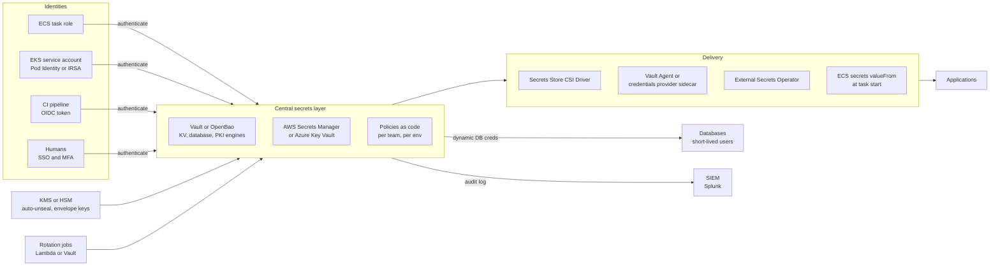

# System Design: Secrets Management at Scale

> Designing company-wide secrets management: a central store (Vault, AWS Secrets Manager, or Azure Key Vault), identity-based access with IAM roles, workload identity, and OIDC for CI, dynamic secrets, rotation, delivery to apps, audit, break-glass, and migration away from secrets in repos and pipelines.

## Key Concepts

### Requirements

- **Scope:** database passwords, API keys, third-party tokens, TLS certificates and private keys, encryption keys, SSH access, CI/CD credentials.
- **Consumers:** ECS Fargate tasks, EKS pods, Lambda, EC2, Databricks jobs, CI pipelines (Azure DevOps, GitHub Actions), and humans.
- **Security goals:** no secrets in Git, images, or pipeline variables; least privilege per workload; short-lived credentials where possible; every read audited; rotation without downtime.
- **Availability:** secret reads are on the critical path at startup, so the store must be highly available and apps should cache.
- **Compliance:** SOC 2 or PCI style controls: access reviews, rotation evidence, separation of duties, audit retention.

Rough scale for 50 teams: about 300 services, 3 environments, 5 to 15 secrets per service, so about 5,000 to 10,000 secrets. Reads are mostly at startup and on refresh, a few hundred per second at peak during large deploys.

### Architecture

Every caller proves **who it is** with a platform identity (IAM role, Kubernetes service account, OIDC token, SSO). The store checks a policy and returns a secret or a short-lived credential. Delivery components fetch and refresh secrets so apps do not need special code. Every request is audited to the SIEM.



TODO (Siva): replace this with what you actually use, for example SSM Parameter Store or Secrets Manager for ECS Fargate tasks, and how Azure DevOps pipelines get their credentials.

### Choosing the Central Store

| Option | Strengths | Limits | Good fit |
| --- | --- | --- | --- |
| HashiCorp Vault | Dynamic secrets, PKI, many auth methods, multi-cloud | You run it (or pay for HCP Vault); BSL 1.1 licence since 2023; replication is an Enterprise feature | Multi-cloud, on-prem, dynamic secrets at scale |
| OpenBao | Open source (MPL 2.0) fork of Vault under the Linux Foundation | Smaller ecosystem than Vault | Teams that want Vault features with an OSI licence |
| AWS Secrets Manager | Managed, IAM-native, built-in rotation for RDS and others, cross-region replicas | AWS only; $0.40 per secret per month plus API calls | AWS-first companies |
| Azure Key Vault | Managed, Entra ID RBAC, keys, secrets, certificates, soft delete and purge protection | Azure only; throttling limits per vault | Azure-first companies |
| SSM Parameter Store | Cheap, SecureString with KMS | No built-in rotation; lower throughput limits | Config and low-risk secrets |

Many companies use a mix: the cloud-native store per cloud, plus Vault where dynamic secrets or multi-cloud matter. The key is **one standard per use case**, not one per team.

### Identity-Based Access

No caller should need a stored secret to fetch secrets. Use the platform's own identity:

- **ECS:** task role (for the app) and task execution role (for pulling images and injecting secrets at start).
- **EKS:** EKS Pod Identity or IRSA, so each service account maps to an IAM role; or the Vault Kubernetes auth method using the service account token.
- **CI/CD:** OIDC federation. GitHub Actions or Azure DevOps issues a signed token per run; AWS IAM, Entra ID, or Vault's JWT auth trusts it based on claims like repo, branch, and environment.
- **Humans:** SSO with MFA; short-lived sessions; no shared admin passwords.
- **Policies:** per team and environment, written as code, for example `secret/data/payments/prod/*` readable only by the payments prod role.

```hcl
# Vault: GitHub Actions OIDC role scoped to one repo and the prod environment
resource "vault_jwt_auth_backend_role" "payments_prod_ci" {
  backend         = "jwt-github"
  role_name       = "payments-prod-ci"
  role_type       = "jwt"
  user_claim      = "repository"
  bound_audiences = ["https://github.com/my-org"]
  bound_claims = {
    repository  = "my-org/payments-api"
    environment = "prod"
  }
  token_policies = ["payments-prod-deploy"]
  token_ttl      = 900
}
```

### Dynamic Secrets and Rotation

- **Dynamic secrets:** Vault's database engine creates a unique database user per lease, with a TTL (for example 1 hour). When the lease ends, Vault drops the user. A leak is limited in time and traceable to one workload.
- **Static secret rotation:** AWS Secrets Manager rotates with a Lambda function, or with managed rotation for supported services (for example RDS master passwords managed by Secrets Manager). Azure Key Vault supports rotation policies for keys and event-driven rotation for secrets.
- **Zero-downtime pattern:** keep two valid credentials during rotation. Secrets Manager uses staging labels (`AWSPENDING`, `AWSCURRENT`, `AWSPREVIOUS`); the "alternating users" strategy keeps two database users and switches between them.
- **Apps must reload:** either re-read the secret on authentication failure, refresh on a timer, or get restarted by the delivery layer. Otherwise rotation causes outages.
- **Third-party API keys** often cannot be rotated by API. Track their age and owner, and rotate on a schedule with a runbook.

### Delivering Secrets to Apps

| Method | How it works | Pros | Cons |
| --- | --- | --- | --- |
| ECS `secrets` with `valueFrom` | ECS injects Secrets Manager or SSM values as env vars at task start | Simple, no code | No refresh without a new task; env vars can leak in dumps |
| Secrets Store CSI Driver | Mounts secrets as files in the pod from AWS, Azure, or Vault providers | Files, optional rotation polling, optional sync to Kubernetes Secret | Pod start depends on the provider |
| External Secrets Operator | Syncs external secrets into Kubernetes Secrets on a schedule | Works with any app that reads K8s Secrets | Secret now also lives in etcd; encrypt etcd with KMS |
| Vault Agent sidecar or injector | Agent authenticates, renders templates to a shared volume, renews leases | Dynamic secrets, templating | Extra container per pod |
| AWS Workload Credentials Provider | Local HTTP cache for Secrets Manager (formerly Secrets Manager Agent) | Fewer API calls, works on ECS, EKS, EC2, Lambda | Cache TTL means short staleness after rotation |
| SDK in app code | App calls the store with caching client | Full control, instant refresh | Code change per app |

```json
{
  "containerDefinitions": [
    {
      "name": "payments-api",
      "secrets": [
        {
          "name": "DB_PASSWORD",
          "valueFrom": "arn:aws:secretsmanager:us-east-1:111122223333:secret:prod/payments/db-AbCdEf:password::"
        }
      ]
    }
  ]
}
```

### Audit, Break-Glass, and Migration

- **Audit:** Vault audit devices (file or socket) to the SIEM; CloudTrail for Secrets Manager `GetSecretValue`; Azure Key Vault diagnostic logs. Alert on reads by unexpected principals, bulk reads, and policy changes.
- **Break-glass:** a sealed emergency role or Vault recovery path, protected by MFA and approval (two people), time-limited, alerting the security team on use, and reviewed afterwards.
- **Migration away from secrets in repos and pipelines:**
  1. Scan all repos and pipeline variables (gitleaks, TruffleHog, GitHub secret scanning). Turn on push protection.
  2. Inventory found secrets with owners.
  3. **Rotate first**, because anything in Git history must be treated as leaked.
  4. Move the new value into the central store; change the app to read it from there.
  5. Replace CI keys with OIDC.
  6. Remove from history if required (`git filter-repo`), knowing forks and clones may still have it.
  7. Block regressions with pre-commit hooks and CI checks.

### Trade-offs

| Decision | Choice | Cost |
| --- | --- | --- |
| Vault vs cloud-native store | Cloud-native for static secrets, Vault for dynamic and multi-cloud | Two systems to learn |
| Env vars vs mounted files | Files for long-running services | Apps must read files; env vars are simpler |
| Sync to Kubernetes Secrets | Only when the app needs it | Secret also stored in etcd |
| Dynamic vs static DB creds | Dynamic for high-risk databases | Connection pool and lease handling in apps |
| Aggressive rotation | Daily for high-risk, 90 days for low-risk | More moving parts and failure chances |

## Interview Questions

<details><summary>Q1. [Advanced] Design secrets management for a company with 50 teams and about 300 services on AWS, with some Azure. <em>(scenario)</em></summary>

**Answer:**

**1. Clarify.** Which runtimes (ECS, EKS, Lambda, Databricks)? Which CI tools? Is there a store today? Compliance needs? Multi-cloud? Do we need dynamic database credentials? I assume AWS-first with some Azure, ECS and EKS, Azure DevOps and GitHub Actions, SOC 2, and secrets currently spread across repos, pipeline variables, and a few Parameter Store entries.

**2. Requirements.**

- No secrets in Git, images, or CI variables.
- Every workload and pipeline authenticates with its own identity; no long-lived keys.
- Least privilege per team and environment; every read audited.
- Rotation without downtime; dynamic credentials for critical databases.
- Highly available reads; break-glass for emergencies.

**3. Estimate.** About 10,000 secrets; peak a few hundred reads per second during big deploys; most reads at startup. Secrets Manager at this size is about $4,000 per month for storage plus API calls, so caching matters.

**4. High-level design.**

- **Stores:** AWS Secrets Manager for AWS static secrets (with cross-region replicas for DR); Azure Key Vault for Azure workloads; Vault (or OpenBao) for dynamic database credentials and internal PKI.
- **Identity:** ECS task roles; EKS Pod Identity; OIDC from GitHub Actions and Azure DevOps (workload identity federation); SSO with MFA for humans.
- **Policy:** naming convention `env/team/service/name`; IAM and Vault policies generated from a team catalogue in Terraform; resource policies to block cross-team access.
- **Delivery:** ECS `secrets` injection for simple cases; Secrets Store CSI Driver on EKS; Vault Agent for dynamic credentials; caching client or the AWS Workload Credentials Provider for high-read apps.
- **Rotation:** managed rotation for RDS; Lambda rotation for other static secrets; Vault leases for dynamic ones.
- **Audit:** CloudTrail and Vault audit logs to Splunk with alerts.

**5. Deep dive: rotation without downtime.** Use two valid versions during rotation (`AWSCURRENT` and `AWSPENDING`, or alternating users). Apps refresh on auth failure or on a timer shorter than the overlap. For ECS env injection, rotation triggers a rolling deployment so tasks pick up the new value. I test rotation in staging with load running.

**6. Failure modes.**

- Store unavailable: apps keep cached values; new tasks may fail to start. Vault runs as a 5-node Raft cluster across three AZs with auto-unseal via KMS; Secrets Manager is a regional managed service with replicas in the DR region.
- Rotation breaks an app: alarms on auth errors; rotation can be paused and the previous version restored.
- KMS key disabled or deleted: everything fails closed; KMS key deletion is protected with a waiting period, SCPs, and alerts.
- Policy mistake grants wide access: policy as code with review and automated tests.

**7. Security.** Encrypt with customer-managed KMS keys; separate keys per environment; no human read on production secrets by default; break-glass with two-person approval; regular access reviews.

**8. Cost.** Secrets Manager charges per secret and per API call; caching cuts calls a lot. Vault costs are mostly people time and infrastructure, or HCP licence.

**9. Migration.** Scan, rotate, move, switch CI to OIDC, block with push protection, in waves by team.

**10. Trade-offs.** Two stores (cloud-native plus Vault) add complexity, but each is used where it is strongest. I would avoid Vault if we did not need dynamic secrets or multi-cloud.

</details>

<details><summary>Q2. [Advanced] Your Vault cluster is down. What happens to running apps and new deployments, and how do you design for it? <em>(scenario)</em></summary>

**Answer:**

**Impact:** running apps keep working with the secrets they already have, until a lease or token expires. New pods that need secrets at start fail. Dynamic database credentials cannot be renewed, so long outages cause auth failures.

**Design for it:**

- Vault HA: integrated Raft storage, 5 nodes across 3 AZs, auto-unseal with AWS KMS, so a restart does not need humans with unseal keys.
- Agents cache tokens and secrets; lease TTLs long enough to survive a short outage (for example 1 hour TTL, renew at 2/3).
- DR: Vault Enterprise has DR and performance replication; with open source, snapshot Raft regularly (`vault operator raft snapshot save`) to S3 in another region and test restores.
- For the most critical startup paths, prefer a managed store (Secrets Manager with regional replicas).
- Monitor: seal status, leader elections, request latency, and lease counts.

```bash
vault status
vault operator raft list-peers
vault operator raft snapshot save /backup/vault-$(date +%F).snap
```

</details>

<details><summary>Q3. [Advanced] An engineer pushed an AWS access key to a public GitHub repo. Walk through your response. <em>(scenario)</em></summary>

**Answer:**

1. **Revoke immediately:** deactivate the access key in IAM. Do not wait to clean Git first; bots find public keys within minutes.
2. **Check activity:** CloudTrail for that access key ID: which APIs, which regions, any new users, roles, keys, or instances.
3. **Contain:** delete anything created by the attacker; attach a deny-all policy to the user if needed; check billing for crypto-mining.
4. **Replace:** give the workload a role (task role, OIDC) instead of a new key.
5. **Clean up:** remove the key from the repo and history; note that forks and caches may still have it.
6. **Prevent:** GitHub push protection and secret scanning, pre-commit gitleaks, SCP or IAM policies that block creating long-lived access keys for most users.

```bash
aws iam update-access-key --user-name ci-legacy --access-key-id AKIA... --status Inactive
aws cloudtrail lookup-events \
  --lookup-attributes AttributeKey=AccessKeyId,AttributeValue=AKIA... \
  --max-results 50
```

</details>

<details><summary>Q4. [Advanced] How do dynamic database credentials work, and what problems do they cause for apps?</summary>

**Answer:**

The app (or Vault Agent) asks Vault for credentials for a role. Vault connects to the database with its own admin account, creates a user with the role's grants and a TTL, and returns the username and password with a lease ID. Before expiry the agent renews the lease or gets new credentials. When the lease ends or is revoked, Vault drops the user.

**Problems and fixes:**

- **Connection pools** hold connections opened with old credentials. When the lease is revoked, Vault's revocation statements usually end that user's sessions and drop it, so old connections break. Set the pool's max connection lifetime shorter than the credential TTL and rebuild the pool when credentials change.
- **Many users:** thousands of short-lived users can stress some databases; use reasonable TTLs.
- **Object ownership:** objects created by a temporary user can be orphaned; use a fixed owner role and `SET ROLE` patterns.
- **Vault as dependency:** if Vault is down, new credentials cannot be issued.

```bash
vault read database/creds/payments-readonly
vault lease revoke -prefix database/creds/payments-readonly
```

</details>

<details><summary>Q5. [Intermediate] How do you rotate a database password without downtime?</summary>

**Answer:**

Use a pattern where two credentials are valid during the switch:

- **AWS Secrets Manager single-user strategy:** creates a new password as `AWSPENDING`, sets it in the database, tests it, then moves the `AWSCURRENT` label. Short risk window for apps holding the old password.
- **Alternating users strategy:** two database users; rotation updates the inactive user's password and switches `AWSCURRENT` to it. The old user still works, so no window.

App side: cache the secret with a refresh interval, and on an authentication error re-fetch the secret and retry once. For ECS env injection, trigger a rolling deployment after rotation.

**Verify:** rotate in staging under load; watch auth error metrics; check `aws secretsmanager describe-secret` shows the new version labels.

</details>

<details><summary>Q6. [Intermediate] How does OIDC let CI pipelines access the cloud without stored secrets? What must you restrict?</summary>

**Answer:**

The CI system issues a signed, short-lived OIDC token for each job. The cloud (AWS IAM, Entra ID, or Vault) is configured to trust that issuer. The job exchanges the token for short-lived credentials (`AssumeRoleWithWebIdentity` on AWS).

**Restrict in the trust policy:**

- `aud` must match the expected audience (for AWS usually `sts.amazonaws.com`).
- `sub` must match the exact repo and branch or environment, for example `repo:my-org/payments-api:environment:prod`. Never use a wildcard like `repo:my-org/*` for production roles.
- Separate roles per environment with least privilege.

```yaml
permissions:
  id-token: write
  contents: read
steps:
  - uses: aws-actions/configure-aws-credentials@v4
    with:
      role-to-assume: arn:aws:iam::111122223333:role/payments-prod-deploy
      aws-region: us-east-1
```

In Azure DevOps, use service connections with workload identity federation for Azure instead of client secrets.

</details>

<details><summary>Q7. [Intermediate] What is the "secret zero" problem, and how do you solve it?</summary>

**Answer:**

To fetch secrets, an app must first prove who it is. If that proof is itself a stored secret (a Vault token or an API key in config), you have just moved the problem. That first credential is "secret zero".

The fix is to use an identity the platform already gives the workload, which nobody has to store:

- AWS IAM role credentials from the instance, task, or pod (via the metadata or Pod Identity agent).
- Kubernetes service account tokens (projected, short-lived, audience-bound) for Vault's Kubernetes auth.
- OIDC tokens from CI systems.
- Azure managed identities and workload identity federation.

The platform's trust in the compute environment becomes the root of trust.

</details>

<details><summary>Q8. [Intermediate] On EKS, would you use the Secrets Store CSI Driver, External Secrets Operator, or a Vault Agent sidecar?</summary>

**Answer:**

- **CSI Driver:** when apps can read files and I do not want secrets stored in etcd. Good default for most services.
- **External Secrets Operator:** when apps or Helm charts expect Kubernetes Secrets (env vars from `secretKeyRef`, ingress TLS secrets). I make sure etcd is encrypted with KMS and RBAC on Secrets is tight.
- **Vault Agent sidecar or Vault Secrets Operator:** when I need dynamic secrets, lease renewal, or templates that render config files.

I pick one default for the platform and document when to use the others, so 50 teams do not invent 50 approaches.

</details>

<details><summary>Q9. [Advanced] How do you design break-glass access and audit for secrets?</summary>

**Answer:**

**Break-glass:**

- A dedicated emergency role or Vault policy, not normal admin rights.
- Access needs MFA and approval from a second person (or a sealed credential split between two people).
- Time-limited sessions; automatic alert to security and the on-call lead on use.
- Works without the normal SSO path in case SSO is down.
- Mandatory review after every use, and regular tests so it works when needed.

**Audit:**

- Vault audit devices enabled (at least two, because Vault blocks requests if it cannot write to any enabled audit device).
- CloudTrail for Secrets Manager and KMS; Key Vault diagnostic logs.
- Ship to Splunk; alert on reads by unexpected principals, bulk reads, reads from new networks, policy changes, and key deletions.
- Quarterly access reviews with team owners.

</details>

<details><summary>Q10. [Intermediate] Secrets Manager costs are growing fast. How do you control them?</summary>

**Answer:**

- **API calls:** apps that call `GetSecretValue` on every request are the usual cause. Use caching clients or the AWS Workload Credentials Provider with a sensible TTL.
- **Secret count:** group related values (for example host, user, password) into one JSON secret instead of separate secrets.
- **Low-risk config:** move non-secret config to Parameter Store or app config.
- **Replicas:** replicate only secrets needed in the DR region; each replica is billed as a secret.
- **Cleanup:** find unused secrets with `LastAccessedDate` and delete them after owner review.

```bash
aws secretsmanager list-secrets \
  --query "SecretList[?LastAccessedDate<'2026-06-01'].[Name,LastAccessedDate]" --output table
```

</details>

<details><summary>Q11. [Advanced] How do you handle secrets for multi-region DR?</summary>

**Answer:**

- **Secrets Manager:** replicate secrets to the DR region; apps in DR read the local replica. Rotation happens on the primary and replicates out.
- **KMS:** use multi-Region keys, or a separate key in the DR region for the replica.
- **Vault:** Enterprise DR or performance replication; with open source, a standby cluster restored from Raft snapshots, tested regularly.
- **Parameter Store:** no built-in replication; manage values with IaC or a sync job.
- **Certificates:** ACM certificates are regional, so request them in both regions.
- **Test:** read every critical secret from the DR region during game days.

See [multi-region DR on AWS](03-multi-region-dr-on-aws.md).

</details>

<details><summary>Q12. [Advanced] You need to remove secrets from 300 repos and dozens of pipelines. How do you plan the migration? <em>(scenario)</em></summary>

**Answer:**

1. **Discover:** run gitleaks or TruffleHog across all repos, including history; export CI variable groups and service connections; list Parameter Store entries.
2. **Triage:** classify each finding (real, test, false positive), find the owner, rank by risk (production, cloud keys first).
3. **Paved road first:** templates and docs that show how to read from the store and use OIDC, so teams have somewhere to move to.
4. **Rotate and move:** for each real secret, create a new value in the store, update the app, then revoke the old one. Treat everything found in Git as compromised.
5. **Replace CI keys** with OIDC roles.
6. **Block regressions:** push protection, pre-commit hooks, a CI check that fails on new findings.
7. **Track progress** per team on a dashboard, with a deadline.

TODO (Siva): if you have done a secrets clean-up, add the scope and what you learned.

</details>

<details><summary>Q13. [Advanced] Looking back at your secrets design, what would you do differently?</summary>

**Answer:**

- Push harder to **remove secrets entirely**: IAM database authentication, OIDC, managed identities, and mTLS with short-lived certificates instead of shared passwords.
- Start with **one delivery pattern per platform** from day one; mixing env vars, files, and SDKs made rotation harder.
- Make **rotation a tested pipeline**, with synthetic checks after each rotation, not a background Lambda nobody watches.
- Generate **policies from the service catalogue** automatically, so access follows ownership changes.
- Revisit **Vault vs managed** after a year: if dynamic secrets are used by only a few services, the operational cost of Vault may not be worth it.

See also [Kubernetes security and secrets](../kubernetes/06-security-rbac-secrets.md), [Azure DevOps security and secrets](../azure-devops/05-security-and-secrets.md), and [DevSecOps](../ops/02-devsecops.md).

</details>
