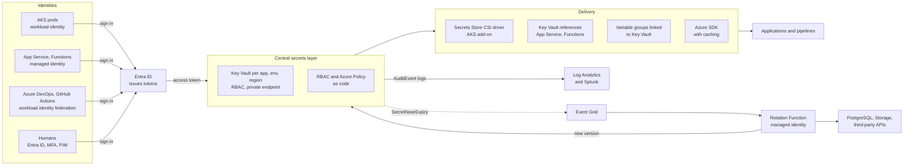

# System Design: Secrets Management at Scale

> Designing company-wide secrets management on Azure: Azure Key Vault with the RBAC model, private endpoints, soft delete and purge protection, managed identities, AKS workload identity with the Secrets Store CSI driver, Azure DevOps variable groups linked to Key Vault, OIDC federation for CI, rotation with Event Grid and Functions, audit, break-glass, and migration away from secrets in repos and pipelines.

## Key Concepts

### Requirements

- **Scope:** database passwords, API keys, third-party tokens, TLS certificates and private keys, encryption keys, SSH access, CI/CD credentials.
- **Consumers:** AKS pods, App Service and Functions apps, VMs and VM Scale Sets, CI pipelines (Azure DevOps, GitHub Actions), and humans.
- **Security goals:** no secrets in Git, images, or pipeline variables; least privilege per workload; short-lived credentials where possible; every read audited; rotation without downtime.
- **Availability:** secret reads are on the critical path at startup, so the store must be highly available and apps should cache.
- **Compliance:** SOC 2 or PCI style controls: access reviews, rotation evidence, separation of duties, audit retention.

Rough scale for 50 teams: about 300 services, 3 environments, 5 to 15 secrets per service, so about 5,000 to 10,000 secrets. Reads are mostly at startup and on refresh, a few hundred per second at peak during large deploys. Key Vault allows about 4,000 secret reads per 10 seconds per vault, so vault layout and caching matter more than storage.

### Architecture

Every caller proves **who it is** with an Entra ID identity (managed identity, AKS workload identity, a federated CI token, or a human with MFA). Key Vault checks Azure RBAC and returns the secret over a private endpoint. Delivery components fetch and refresh secrets so apps do not need special code. Every request is audited, and rotation is event driven.



TODO (Siva): replace this with what you actually use, for example how your AKS pods read from Key Vault (CSI driver or SDK), whether your Azure DevOps pipelines use variable groups linked to Key Vault, and how your service connections authenticate.

### Choosing the Central Store

| Option | Strengths | Limits | Good fit |
| --- | --- | --- | --- |
| Azure Key Vault (Standard or Premium) | Managed, Entra ID and Azure RBAC, secrets, keys, and certificates, soft delete and purge protection, Event Grid events, private endpoints | Azure only; throttling limits per vault; no dynamic database users | Default for Azure workloads |
| Azure Key Vault Managed HSM | Single-tenant HSM pool, higher limits for keys | Keys only, higher cost | Strict key custody and high-volume crypto |
| Azure App Configuration | Feature flags and non-secret config, with Key Vault references for secrets | Not a secret store itself | Config that changes often |
| HashiCorp Vault or OpenBao | Dynamic secrets, PKI, multi-cloud, many auth methods | You run it (or pay for HCP Vault); more operations work | Only if you truly need dynamic secrets or multi-cloud |

The default is Key Vault. I add Vault (or OpenBao) only if a clear need appears, such as dynamic credentials for a database that does not support Entra ID authentication, or workloads outside Azure. The key is **one standard per use case**, not one per team.

### Key Vault Setup and Layout

- **Permission model:** use Azure RBAC, not access policies. New vaults created with API version 2026-02-01 or later default to RBAC. Assign roles at vault scope (or secret scope for special cases): **Key Vault Secrets User** for apps, **Key Vault Secrets Officer** for the team's pipeline that writes secrets, **Key Vault Reader** for metadata only.
- **Layout:** Microsoft recommends one vault per application per environment per region. That keeps the blast radius and throttling per app. A pragmatic middle ground at 300 services is one vault per team per environment per region.
- **Network:** private endpoint plus the `privatelink.vaultcore.azure.net` Private DNS zone, and public network access disabled. Allow trusted Microsoft services only where needed.
- **Protection:** soft delete is always on (7 to 90 days retention). Turn on purge protection, which cannot be turned off later. Add a resource lock on production vaults.
- **Guardrails with Azure Policy:** require RBAC mode, purge protection, private link, and an expiration date on secrets and certificates.

```bash
az keyvault create -g rg-payments-prod -n kv-payments-prod-eus2 -l eastus2 \
  --enable-rbac-authorization true --enable-purge-protection true \
  --retention-days 90 --public-network-access Disabled
```

### Identity-Based Access

No caller should need a stored secret to fetch secrets. Use the platform's own identity:

- **AKS:** Microsoft Entra Workload ID. A Kubernetes service account is linked to a user-assigned managed identity through a federated credential that trusts the cluster's OIDC issuer.
- **App Service and Functions:** a system-assigned or user-assigned managed identity, and Key Vault references in app settings.
- **VMs and VM Scale Sets:** a managed identity; the app gets tokens from the instance metadata endpoint.
- **CI/CD:** workload identity federation. Azure DevOps service connections and GitHub Actions get a short-lived token per run; Entra ID trusts it based on the issuer and subject.
- **Humans:** Entra ID with MFA and Conditional Access; Privileged Identity Management (PIM) for just-in-time access to production vaults; no shared admin passwords.

```bash
# AKS workload identity for the payments-api service account
az aks update -g rg-aks-prod -n aks-prod --enable-oidc-issuer --enable-workload-identity
ISSUER=$(az aks show -g rg-aks-prod -n aks-prod --query oidcIssuerProfile.issuerUrl -o tsv)

az identity create -g rg-identities-prod -n id-payments-api
az identity federated-credential create -g rg-identities-prod --identity-name id-payments-api \
  --name aks-prod-payments-api --issuer "$ISSUER" \
  --subject system:serviceaccount:payments:payments-api \
  --audiences api://AzureADTokenExchange

# Read-only access to one vault
az role assignment create --role "Key Vault Secrets User" \
  --assignee-object-id "$(az identity show -g rg-identities-prod -n id-payments-api --query principalId -o tsv)" \
  --assignee-principal-type ServicePrincipal \
  --scope "$(az keyvault show -n kv-payments-prod-eus2 --query id -o tsv)"
```

The Kubernetes service account gets the annotation `azure.workload.identity/client-id`, and the pod gets the label `azure.workload.identity/use: "true"`.

### Rotation and Removing Secrets

- **Remove secrets first:** many Azure services accept Entra ID tokens, so there is no password at all. Use managed identities for PostgreSQL Flexible Server (Entra authentication), Storage, Service Bus, Event Hubs, and Key Vault. Disable local auth (shared keys, SAS, local SQL users) with Azure Policy where you can.
- **Event-driven rotation:** set an expiry date on every secret. Key Vault publishes `Microsoft.KeyVault.SecretNearExpiry` to Event Grid (30 days before expiry). An Azure Function with a managed identity creates a new credential in the target system and writes it as a new secret version.
- **Zero-downtime pattern:** keep two valid credentials during rotation. Storage accounts have `key1` and `key2`; for databases, the "alternating users" pattern keeps two users and switches between them.
- **Keys and certificates:** key rotation policies rotate keys automatically; certificates auto-renew with an integrated CA, or send near-expiry events for manual renewal.
- **Apps must reload:** the CSI driver can poll for new versions and update the mounted file, but env vars and synced Kubernetes Secrets need a pod restart. App Service Key Vault references without a version refresh within 24 hours, or right away on a config change or restart. Re-read the secret on an authentication failure.
- **Third-party API keys** often cannot be rotated by API. Track their age and owner with expiry dates, and rotate on a schedule with a runbook.

### Delivering Secrets to Apps

| Method | How it works | Pros | Cons |
| --- | --- | --- | --- |
| Secrets Store CSI driver (AKS add-on) | Mounts Key Vault secrets as files using workload identity | Files, rotation polling, optional sync to a Kubernetes Secret | Pod start depends on Key Vault and private DNS |
| Azure SDK with workload identity | App calls Key Vault with `DefaultAzureCredential` and caches | Full control, instant refresh | Code change per app |
| Key Vault references | App Service and Functions resolve `@Microsoft.KeyVault(...)` app settings | No code change | Refresh can lag up to 24 hours unless restarted |
| Azure DevOps variable group linked to Key Vault | Pipeline fetches secrets at run time through a service connection | Central values, masked in logs | Any step in the job can read them; keep scope small |
| External Secrets Operator | Syncs Key Vault secrets into Kubernetes Secrets | Works with charts that expect Kubernetes Secrets | Secret also lives in etcd; turn on AKS KMS etcd encryption |
| Vault Agent (alternative) | Agent renders secrets and renews leases | Dynamic secrets | You run Vault |

```yaml
apiVersion: secrets-store.csi.x-k8s.io/v1
kind: SecretProviderClass
metadata:
  name: payments-kv
  namespace: payments
spec:
  provider: azure
  parameters:
    clientID: "<client-id-of-id-payments-api>"
    keyvaultName: kv-payments-prod-eus2
    tenantId: "<tenant-id>"
    objects: |
      array:
        - |
          objectName: db-password
          objectType: secret
```

### Audit, Break-Glass, and Migration

- **Audit:** Key Vault Diagnostic Settings send `AuditEvent` logs to Log Analytics and on to Splunk. The Activity Log records RBAC and vault changes. Microsoft Defender for Key Vault flags unusual access. Alert on reads by unexpected identities, bulk reads, purge attempts, and role assignment changes.
- **Break-glass:** two Entra ID emergency access accounts with phishing-resistant MFA, plus PIM eligible roles that need approval from a second person. Sessions are time-limited, every use alerts security and the on-call lead, and each use is reviewed afterwards.
- **Migration away from secrets in repos and pipelines:**
  1. Scan all repos and pipeline variables (gitleaks, TruffleHog, GitHub secret scanning, or GitHub Advanced Security for Azure DevOps). Turn on push protection.
  2. Inventory found secrets with owners.
  3. **Rotate first**, because anything in Git history must be treated as leaked.
  4. Move the new value into Key Vault; change the app to read it from there, or replace it with a managed identity.
  5. Convert secret-based service connections to workload identity federation.
  6. Remove from history if required (`git filter-repo`), knowing forks and clones may still have it.
  7. Block regressions with pre-commit hooks and CI checks.

### Trade-offs

| Decision | Choice | Cost |
| --- | --- | --- |
| Key Vault vs Vault | Key Vault by default; Vault only for proven dynamic or multi-cloud needs | Fewer features than Vault, but nothing to run |
| Vault layout | Per team per environment per region | More vaults to manage, but smaller blast radius and throttling scope |
| Env vars vs mounted files | Files for long-running services | Apps must read files; env vars are simpler |
| Sync to Kubernetes Secrets | Only when the app needs it | Secret also stored in etcd |
| Passwords vs Entra ID auth | Entra ID tokens wherever the service supports it | App changes and token refresh in connection pools |
| Aggressive rotation | Daily for high-risk, 90 days for low-risk | More moving parts and failure chances |

## Interview Questions

<details><summary>Q1. [Advanced] Design secrets management for a company with 50 teams and about 300 services on Azure. <em>(scenario)</em></summary>

**Answer:**

**1. Clarify.** Which runtimes (AKS, App Service, Functions, VMs)? Which CI tools? Is there a store today? Compliance needs? Any workloads outside Azure? Do we need dynamic database credentials? I assume Azure only, AKS and App Service, Azure DevOps and GitHub Actions, SOC 2, and secrets spread across repos, pipeline variables, and a few shared vaults.

**2. Requirements.**

- No secrets in Git, images, or CI variables.
- Every workload and pipeline authenticates with its own identity; no client secrets.
- Least privilege per team and environment; every read audited.
- Rotation without downtime; no passwords at all where Entra ID auth is possible.
- Highly available reads; break-glass for emergencies.

**3. Estimate.** About 10,000 secrets; peak a few hundred reads per second during big deploys; most reads at startup. One vault allows about 4,000 secret reads per 10 seconds, and the subscription allows five times one vault's limit, so I spread vaults per team and use caching.

**4. High-level design.**

- **Store:** Key Vault per team per environment per region, RBAC mode, private endpoints, purge protection. No Vault unless a clear need appears.
- **Identity:** AKS workload identity; managed identities for App Service, Functions, and VMs; workload identity federation for Azure DevOps and GitHub Actions; Entra ID with MFA and PIM for humans.
- **Policy:** naming convention `team-service-name`, RBAC assignments generated from a team catalogue in Terraform or Bicep, and Azure Policy for RBAC mode, purge protection, private link, and secret expiry.
- **Delivery:** Secrets Store CSI driver on AKS; Key Vault references on App Service; variable groups linked to Key Vault for pipelines; SDK with caching for high-read apps.
- **Rotation:** Entra ID auth for PostgreSQL, Storage, and Service Bus so there is nothing to rotate; Event Grid `SecretNearExpiry` plus a Function for the rest.
- **Audit:** `AuditEvent` logs to Log Analytics and Splunk with alerts; Defender for Key Vault.

**5. Deep dive: rotation without downtime.** Use two valid credentials during rotation (storage `key1`/`key2`, or alternating database users). The Function updates the inactive credential, writes a new secret version, and later retires the old one. Apps refresh on auth failure or on a timer shorter than the overlap; the CSI driver polls for new versions. I test rotation in staging with load running.

**6. Failure modes.**

- Key Vault unreachable: usually private DNS or a private endpoint problem, not the service. Running apps keep cached values; new pods may fail to mount. Monitor availability and DNS.
- Throttling (HTTP 429): too many reads from one vault. Cache, spread vaults, and lower CSI polling frequency.
- Rotation breaks an app: alerts on auth errors; roll back by setting the previous secret version as current and re-enabling the old credential.
- Vault or secret deleted: soft delete and purge protection allow recovery; a resource lock blocks accidental vault deletion.
- RBAC mistake grants wide access: role assignments as code with review and automated tests.

**7. Security.** Private endpoints only, RBAC least privilege, no standing human access to production secrets, PIM with approval, customer-managed keys in Premium vaults or Managed HSM where compliance asks for it, regular access reviews.

**8. Cost.** Key Vault charges mainly per operation, so cost is small. The real limits are throttling and the people time to run rotation. Vault would add infrastructure and operations cost.

**9. Migration.** Scan, rotate, move, convert service connections to workload identity federation, block with push protection, in waves by team.

**10. Trade-offs.** Key Vault has no dynamic database users, but Entra ID authentication removes most database passwords anyway. More vaults mean more objects to manage, but each team's blast radius and throttling stay small.

</details>

<details><summary>Q2. [Advanced] Pods cannot start because the Secrets Store CSI driver cannot reach Key Vault. What happens to running apps and new deployments, and how do you design for it? <em>(scenario)</em></summary>

**Answer:**

**Impact:** running pods keep the files already mounted and any values cached in memory. New pods stay in `ContainerCreating` with a `FailedMount` event, so scale-outs and deploys fail. App Service apps that restart may show an unresolved Key Vault reference.

**Troubleshoot:**

```bash
kubectl describe pod payments-api-7d9f8 -n payments          # FailedMount from secrets-store.csi.k8s.io
kubectl logs -n kube-system -l app=secrets-store-provider-azure --tail=50
nslookup kv-payments-prod-eus2.vault.azure.net                 # must resolve to a private IP
az monitor metrics list --resource "$(az keyvault show -n kv-payments-prod-eus2 --query id -o tsv)" \
  --metric ServiceApiResult --filter "StatusCode eq '429'" --interval PT5M
```

Common causes: the Private DNS zone is not linked to the AKS VNet, the federated credential subject does not match the service account, the role assignment is missing or still propagating, or the vault is throttling.

**Design for it:**

- Private endpoint and Private DNS zone links managed in IaC, with a synthetic check that resolves and reads a test secret.
- Cache secrets in apps; use SDK retries with exponential backoff.
- Spread load across vaults per team and per region; keep CSI polling reasonable.
- Alert on Key Vault availability, latency, and 429 responses.
- For a regional problem, pods in the DR region use the DR region's own vault.

</details>

<details><summary>Q3. [Advanced] An engineer pushed a service principal client secret to a public GitHub repo. Walk through your response. <em>(scenario)</em></summary>

**Answer:**

1. **Revoke immediately:** delete the client secret from the app registration. Do not wait to clean Git first; bots find public secrets within minutes. Access tokens already issued stay valid until they expire (usually about an hour), so keep watching.
2. **Check activity:** service principal sign-in logs and the Activity Log for that app ID: which resources, which IP addresses, any new role assignments, identities, or VMs.
3. **Contain:** remove anything created by the attacker; remove or reduce the service principal's role assignments if needed; check cost for crypto-mining.
4. **Replace:** move the workload to a managed identity or workload identity federation instead of a new secret.
5. **Clean up:** remove the secret from the repo and history; note that forks and caches may still have it.
6. **Prevent:** push protection and secret scanning, pre-commit gitleaks, and Entra ID app management policies that block new client secrets on most apps.

```bash
az ad app credential list --id <app-id> -o table
az ad app credential delete --id <app-id> --key-id <key-id>
```

```kusto
AADServicePrincipalSignInLogs
| where TimeGenerated > ago(7d) and AppId == "<app-id>"
| summarize SignIns = count() by IPAddress, ResourceDisplayName, ResultType
```

</details>

<details><summary>Q4. [Advanced] How do you remove database passwords entirely on Azure, and what problems does it cause for apps?</summary>

**Answer:**

Use Microsoft Entra authentication on PostgreSQL Flexible Server. The app's managed identity (or AKS workload identity) gets an access token for the database and uses it as the password. There is no stored password to leak or rotate.

```sql
-- Run as the Entra ID admin of the server: map the managed identity to a database role
SELECT * FROM pgaadauth_create_principal('id-payments-api', false, false);
GRANT CONNECT ON DATABASE orders TO "id-payments-api";
```

**Problems and fixes:**

- **Token lifetime:** tokens expire after about an hour. The token is checked only when a connection opens, so the connection pool must fetch a fresh token for every new connection (a password callback), not cache one at startup.
- **Role management:** roles must be created by an Entra ID admin and kept in code, or access drifts.
- **Local tools:** engineers connect with their own Entra ID account (`az account get-access-token --resource-type oss-rdbms`), which also improves audit.
- **Services without Entra auth:** for third-party databases, keep a password in Key Vault with event-driven rotation, or use Vault's database engine for dynamic users if you already run Vault.

</details>

<details><summary>Q5. [Intermediate] How do you rotate a database password or storage key without downtime?</summary>

**Answer:**

Use a pattern where two credentials are valid during the switch, and let events drive it:

- **Storage account keys:** apps use `key1`. Rotation regenerates `key2`, stores it in Key Vault as the new version, waits for apps to pick it up, then regenerates `key1` next time. Better still, use managed identities and disable shared key access.
- **Database alternating users:** two users (`app_a` and `app_b`). Rotation resets the inactive user's password and points the secret to it. The old user still works, so there is no window.
- **Trigger:** the secret has an expiry date; Key Vault sends `SecretNearExpiry` to Event Grid; a Function with a managed identity does the rotation.

```bash
az eventgrid event-subscription create --name kv-near-expiry \
  --source-resource-id "$(az keyvault show -n kv-payments-prod-eus2 --query id -o tsv)" \
  --endpoint-type azurefunction \
  --endpoint "<function-app-resource-id>/functions/RotateSecret" \
  --included-event-types Microsoft.KeyVault.SecretNearExpiry
```

App side: cache the secret with a refresh interval, and on an authentication error re-fetch the secret and retry once. If the app reads env vars, trigger a rolling restart after rotation.

**Verify:** rotate in staging under load; watch auth error metrics; check `az keyvault secret list-versions` shows the new version with a new expiry.

</details>

<details><summary>Q6. [Intermediate] How does OIDC federation let CI pipelines access Azure without stored secrets? What must you restrict?</summary>

**Answer:**

The CI system issues a signed, short-lived OIDC token for each job. Entra ID is configured with a federated credential on an app registration or user-assigned managed identity that trusts that issuer. The job exchanges the token for a short-lived Entra ID access token.

**Restrict in the federated credential and around it:**

- **Issuer** must be the exact CI issuer.
- **Subject** must match one exact repo and environment (GitHub, for example `repo:my-org/payments-api:environment:prod`) or one service connection (Azure DevOps). Avoid broad matches for production identities.
- **Audience** is `api://AzureADTokenExchange`.
- One identity per team per environment, with RBAC scoped to that team's resource groups.
- In Azure DevOps, add approvals, branch control, and the Required template check on production service connections.

```yaml
permissions:
  id-token: write
  contents: read
steps:
  - uses: azure/login@v2
    with:
      client-id: ${{ vars.AZURE_CLIENT_ID }}
      tenant-id: ${{ vars.AZURE_TENANT_ID }}
      subscription-id: ${{ vars.AZURE_SUBSCRIPTION_ID }}
```

In Azure DevOps, create Azure Resource Manager service connections with workload identity federation, and convert old secret-based connections.

</details>

<details><summary>Q7. [Intermediate] What is the "secret zero" problem, and how do you solve it?</summary>

**Answer:**

To fetch secrets, an app must first prove who it is. If that proof is itself a stored secret (a client secret or an API key in config), you have just moved the problem. That first credential is "secret zero".

The fix is to use an identity the platform already gives the workload, which nobody has to store:

- Managed identities on App Service, Functions, and VMs (tokens come from the platform's local endpoint).
- AKS workload identity: projected, short-lived service account tokens exchanged with Entra ID.
- OIDC tokens from CI systems through workload identity federation.

The platform's trust in the compute environment becomes the root of trust.

</details>

<details><summary>Q8. [Intermediate] On AKS, would you use the Secrets Store CSI driver, External Secrets Operator, or the Azure SDK in the app?</summary>

**Answer:**

- **Secrets Store CSI driver (AKS add-on):** when apps can read files and I do not want secrets stored in etcd. Good default for most services, with workload identity and rotation polling turned on.
- **External Secrets Operator:** when apps or Helm charts expect Kubernetes Secrets (env vars from `secretKeyRef`, ingress TLS secrets). I make sure AKS KMS etcd encryption is on and RBAC on Secrets is tight.
- **Azure SDK with workload identity:** when the app needs instant refresh or reads many secrets, and the team can own the code.
- **Vault Agent:** only if we already run Vault for dynamic secrets.

I pick one default for the platform and document when to use the others, so 50 teams do not invent 50 approaches.

</details>

<details><summary>Q9. [Advanced] How do you design break-glass access and audit for secrets?</summary>

**Answer:**

**Break-glass:**

- Two Entra ID emergency access accounts, cloud-only, with phishing-resistant MFA, excluded from Conditional Access policies that could lock them out, and monitored.
- PIM eligible roles (for example Key Vault Secrets Officer on production vaults) that need approval from a second person.
- Time-limited sessions; automatic alert to security and the on-call lead on use.
- Mandatory review after every use, and regular tests so it works when needed.

**Audit:**

- Diagnostic Settings on every vault (enforced by Azure Policy) send `AuditEvent` logs to Log Analytics and Splunk.
- The Activity Log covers role assignments, vault changes, and deletes.
- Alert on reads by unexpected identities, bulk reads, reads from new networks, purge attempts, and RBAC changes.
- Quarterly access reviews with team owners.

```kusto
AzureDiagnostics
| where ResourceProvider == "MICROSOFT.KEYVAULT" and OperationName == "SecretGet"
| summarize Reads = count() by Resource, identity_claim_appid_g, bin(TimeGenerated, 1h)
| where Reads > 500
```

</details>

<details><summary>Q10. [Intermediate] Key Vault requests are being throttled and operation counts are growing fast. How do you control them?</summary>

**Answer:**

- **Find the callers:** group `AuditEvent` logs by vault, operation, and caller app ID.
- **Per-request reads:** apps that call Key Vault on every request are the usual cause. Read at startup and cache with a sensible TTL.
- **CSI polling:** 1,000 pods, 5 secrets each, polled every 2 minutes adds up. Use a longer interval where fast rotation is not needed.
- **Spread load:** split a shared vault into per-team or per-app vaults; remember the subscription-wide limit too.
- **Non-secret config:** move it to App Configuration or app settings, not Key Vault.
- **Cleanup:** find unused secrets (no reads in 90 days) and disable or delete them after owner review.

</details>

<details><summary>Q11. [Advanced] How do you handle secrets for multi-region DR?</summary>

**Answer:**

- **Key Vault per region:** each region's workloads read their own vault. A pipeline or the rotation Function writes every new version to both vaults.
- **Do not rely on Microsoft-managed failover:** Microsoft can fail a vault over to the paired region, but it decides when (it can take hours), and the vault is read-only afterwards.
- **Identities per region:** a user-assigned managed identity per region, with the same role assignments, so sign-ins do not depend on the primary region.
- **Keys and certificates:** customer-managed keys and TLS certificates must exist in both regions (for example for the DR Application Gateway).
- **Private DNS:** private endpoints and DNS zone links for the DR VNet.
- **Test:** read every critical secret from the DR region during DR drills.

See [multi-region DR on Azure](03-multi-region-dr-on-azure.md).

</details>

<details><summary>Q12. [Advanced] You need to remove secrets from 300 repos and dozens of pipelines. How do you plan the migration? <em>(scenario)</em></summary>

**Answer:**

1. **Discover:** run gitleaks or TruffleHog across all repos, including history; export Azure DevOps variable groups, secret variables, and service connections that use client secrets.
2. **Triage:** classify each finding (real, test, false positive), find the owner, rank by risk (production, Azure credentials first).
3. **Paved road first:** templates and docs that show how to read from Key Vault, use managed identities, and use federated service connections, so teams have somewhere to move to.
4. **Rotate and move:** for each real secret, create a new value in Key Vault (or replace it with a managed identity), update the app, then revoke the old one. Treat everything found in Git as compromised.
5. **Replace CI secrets** with workload identity federation.
6. **Block regressions:** push protection, pre-commit hooks, a CI check that fails on new findings.
7. **Track progress** per team on a dashboard, with a deadline.

TODO (Siva): if you have done a secrets clean-up (for example moving pipeline secrets into Key Vault-linked variable groups), add the scope and what you learned.

</details>

<details><summary>Q13. [Advanced] Looking back at your secrets design, what would you do differently?</summary>

**Answer:**

- Push harder to **remove secrets entirely**: Entra ID authentication for databases and Azure services, workload identity federation, and mTLS with short-lived certificates instead of shared passwords.
- Start with **one delivery pattern per platform** from day one; mixing env vars, files, and SDKs made rotation harder.
- Make **rotation a tested pipeline**, with synthetic checks after each rotation, not a background Function nobody watches.
- Generate **RBAC assignments from the service catalogue** automatically, so access follows ownership changes.
- Revisit **adding Vault** only if dynamic secrets or non-Azure workloads become a real need.

See also [Kubernetes security and secrets](../kubernetes/06-security-rbac-secrets.md), [Azure DevOps security and secrets](../azure-devops/05-security-and-secrets.md), [HashiCorp Vault](../ops/06-hashicorp-vault.md), and [DevSecOps](../ops/02-devsecops.md).

</details>
