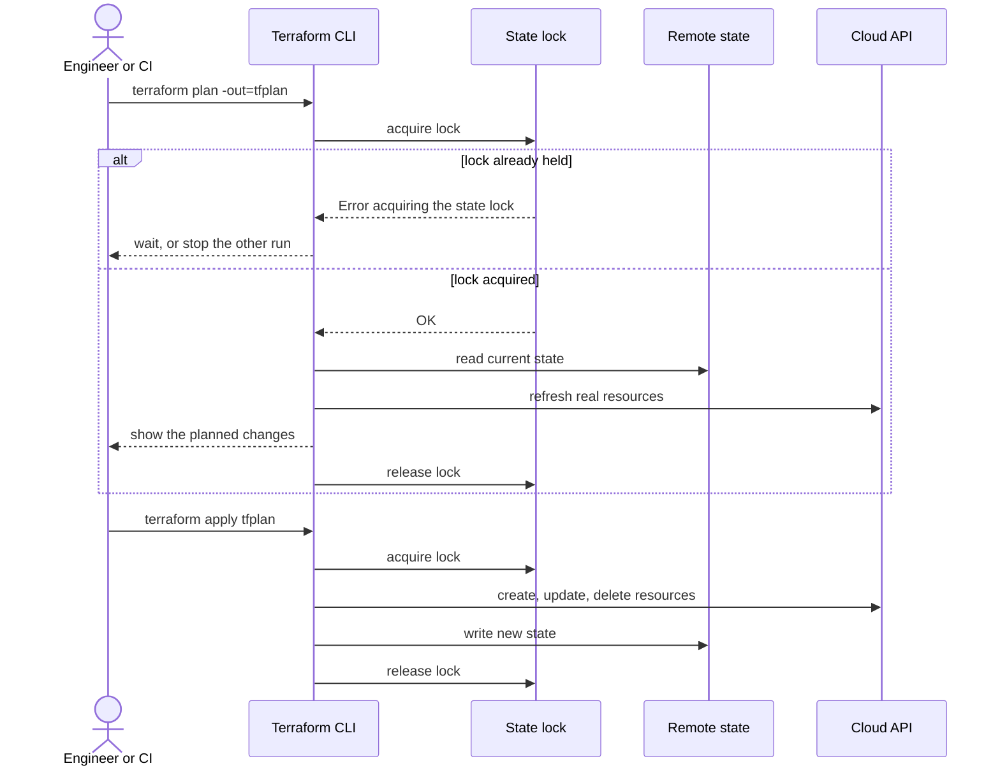

# Terraform: State, Backends and Locking

> What state is, remote backends, securing and sharing state, locking and lock contention, backend migration, splitting large state, and recovering a deleted or corrupted state file.

## Key Concepts

### State and locking

#### What state is

A file that maps each Terraform address to the real resource ID, plus the attributes needed to build a plan. It is not your source code and not a backup of your data.

#### Locking

Locking stops two applies writing at the same time. If someone else holds it:

```text
Error: Error acquiring the state lock
  ID:   4f1c8b32-...
  Who:  runner@ci-agent-3
```

Wait, or stop that job cleanly. Only after proving nothing is running:

```bash
terraform force-unlock 4f1c8b32-...
```

#### Console change example

Someone edits an EC2 instance in the AWS console. Terraform does **not** update your `.tf` files.

1. `terraform plan -refresh-only` to see the drift without proposing changes.
2. Decide whether the change should stay.
3. To keep it, update the code and review a normal plan.
4. To reject it, apply the reviewed plan so Terraform restores the declared value.

#### Backend note

Current Terraform versions can lock the S3 backend with `use_lockfile = true`. The older DynamoDB lock table still exists in many projects but is the legacy approach.

### Plan and Apply with Remote State Locking

Both `plan` and `apply` take the state lock, so two runs can never write the state at the same time. The lock lives in the backend: a DynamoDB table or an S3 lock file on AWS, or a blob lease on Azure Storage.



### State file best practices

1. Remote backend, never a local file for team work.
2. Locking on.
3. Encryption at rest and in transit.
4. Versioning or soft delete for recovery.
5. One state key per environment and component.
6. Only the pipeline writes to production state.
7. Never commit state to Git.
8. Treat state as sensitive; it can contain secret values.

```hcl
terraform {
  backend "s3" {
    bucket       = "my-tf-state"
    key          = "prod/app/terraform.tfstate"
    region       = "us-east-1"
    encrypt      = true
    use_lockfile = true
  }
}
```

## Interview Questions

### 1. What is a Terraform backend?

#### What it is

A backend is the place where Terraform stores the state file.

- **Local backend:** `terraform.tfstate` on your laptop. Default.
- **Remote backend:** S3, Azure Storage, GCS, or Terraform Cloud.

#### Example

```hcl
terraform {
  backend "s3" {
    bucket = "my-tf-state"
    key    = "prod/app/terraform.tfstate"
    region = "us-east-1"
  }
}
```

#### Points to remember

- The backend is set up before anything else, so you cannot use normal variables inside it. Use `-backend-config` files instead.
- Keep one state key per environment.
- To change backends, run `terraform init -migrate-state` and take a backup first.

#### Interview answer

"A backend decides where the state file is stored. Local means the file sits on your machine, which is not good for teams. Remote backends like S3, Azure Storage, or Terraform Cloud allow shared state with encryption, versioning, and locking. Backend settings cannot use normal variables, so I pass them with a backend config file."

### 2. Why use a remote backend?

#### Reasons

1. **One shared state** instead of a copy on every laptop.
2. **Locking**, so two people cannot apply at the same time.
3. **Encryption** of a file that can hold sensitive values.
4. **Versioning**, so you can restore an older state.
5. **Access control and audit logs.**
6. **CI/CD can reach it**, laptops are not needed.

#### Interview answer

"A remote backend gives the team one shared state file with locking, encryption, versioning, and access control. Without it, everyone keeps their own copy and two applies can overwrite each other. It also lets the pipeline run Terraform instead of running it from a laptop."

### 3. How do you migrate from one backend to another?

#### Steps

```bash
# 1. Back up the current state
terraform state pull > backup.tfstate

# 2. Change the backend block in code

# 3. Migrate
terraform init -migrate-state

# 4. Confirm
terraform plan   # must show no changes
```

#### Example: local to S3

```hcl
terraform {
  backend "s3" {
    bucket  = "my-tf-state"
    key     = "prod/terraform.tfstate"
    region  = "us-east-1"
    encrypt = true
  }
}
```

#### Points to remember

- Do it in a maintenance window.
- Make sure no one else is running Terraform.
- Keep the old state until the new one is proven.

#### Interview answer

"I back up the state with `terraform state pull`, update the backend block, run `terraform init -migrate-state`, and confirm the migration by running a plan that shows no changes. I do it when nobody else is running Terraform, and I keep the old copy until the new backend is proven working."

### 4. How do you store the state file securely?

#### Checklist

- Remote backend with encryption at rest and TLS in transit.
- Versioning or soft delete turned on.
- Locking enabled.
- Separate state path per environment.
- Only the pipeline identity can write to production state.
- Never commit state or plan files to Git.

#### Example `.gitignore`

```text
*.tfstate
*.tfstate.*
.terraform/
*.tfplan
```

#### Important point

Even if an output is marked `sensitive`, the value can still exist inside the state file. So read access must be protected just like write access.

#### Interview answer

"State goes into a remote backend with encryption, versioning, locking, and restricted access. Each environment has its own state path, and only the deployment identity can write to production. State can contain secrets even when outputs are marked sensitive, so I protect read access as strongly as write access, and I never commit state to Git."

### 5. How do you secure the state file? *(scenario)*

#### Checklist

1. Remote backend, never local for shared work
2. Encryption at rest with a managed key
3. Versioning or soft delete
4. Locking
5. IAM: only the pipeline identity writes, few humans read
6. Separate state per environment
7. Never in Git

#### Example

```hcl
terraform {
  backend "azurerm" {
    resource_group_name  = "tfstate-rg"
    storage_account_name = "tfstateprod"
    container_name       = "tfstate"
    key                  = "prod/app.tfstate"
  }
}
```

#### Interview answer

"State goes in a remote backend with encryption, versioning, locking, and tight IAM, separated per environment, and never in Git. The point I always make is that state can contain secret values, so read access has to be as restricted as write access, and the restore procedure should be tested before you actually need it."

### 6. How do you manage the state file day to day?

#### Treat state like a production database

- Encrypted, versioned, locked remote backend.
- Least privilege access, audit logs on.
- Separate state per environment and component.
- All normal changes go through the pipeline.

#### Before any state operation

1. Confirm the exact backend key and workspace.
2. Make sure no apply is running.
3. Save a backup: `terraform state pull > backup.tfstate`.
4. Do one change at a time.
5. Run a full plan afterwards.

#### Safe commands

```bash
terraform state list
terraform state show <address>
terraform state mv <old> <new>
terraform state rm <address>     # stops managing, does not delete the resource
terraform import <address> <id>
```

#### Interview answer

"I treat state as a protected production database: encrypted, versioned, locked, with least-privilege access and separate states per environment. All normal changes go through the pipeline. Before any state operation I confirm the backend key, check that no apply is running, and pull a backup. I use supported commands like `state mv`, `state rm`, `import`, and `moved` blocks instead of editing the JSON."

### 7. Can you edit the state file manually?

#### Technically yes, but do not

Editing the JSON can break lineage, serial numbers, provider addresses, and dependencies, and then the next plan can be destructive.

#### Use supported commands instead

| Need | Command |
|---|---|
| Rename or move a resource | `terraform state mv` |
| Stop managing without deleting | `terraform state rm` |
| Adopt an existing resource | `terraform import` |
| Refactor in code, reviewable | `moved` block |

#### Example `moved` block

```hcl
moved {
  from = aws_instance.web
  to   = module.compute.aws_instance.web
}
```

#### Interview answer

"You can, but I avoid it. Manual JSON edits can break lineage and dependencies and cause destructive plans. I use `state mv`, `state rm`, `import`, and `moved` blocks, always with a backup and a full plan afterwards. And I remind people that changing state does not change the real cloud resource."

### 8. How does a team share state? *(scenario)*

#### Setup

```hcl
terraform {
  backend "s3" {
    bucket       = "my-tf-state"
    key          = "prod/app/terraform.tfstate"
    region       = "us-east-1"
    encrypt      = true
    use_lockfile = true
  }
}
```

#### Rules for the team

1. One state key per environment and component.
2. Locking always on.
3. Versioning on for recovery.
4. Humans get read access, the pipeline gets write access.
5. Nobody applies from a laptop against production.

#### Interview answer

"State lives in a shared remote backend with encryption, locking, and versioning, with one key per environment and component. The pipeline is the only identity that writes to production; engineers get read access so they can plan but not apply. That combination is what actually prevents two people overwriting each other."

### 9. What happens if two people apply at the same time?

#### Without locking

Both read the same old state, make conflicting changes, and the last write wins. You can end up with lost state entries, duplicate resources, or broken infrastructure.

#### With locking

The second run waits or fails with a message like:

```text
Error: Error acquiring the state lock
Lock Info:
  ID:        1a2b3c
  Operation: OperationTypeApply
  Who:       user@host
```

#### Also needed

Locking protects the state file, but it does not make two different business changes compatible. So the pipeline should also allow only one deployment job per state.

#### If a lock is stuck after a crashed job

```bash
terraform force-unlock 1a2b3c
```

Only after you have proved nothing is running.

#### Interview answer

"Without locking, both runs plan from the same old state and can overwrite each other, which causes lost state entries or duplicate resources. A remote backend with locking makes the second run wait or fail. I also serialize the deployment job per state, because locking protects the file but not the logic. If a lock is stuck after a crash, I confirm no apply is running before using `force-unlock` with the exact ID."

### 10. Two people run apply at the same time. What happens? *(scenario)*

#### With a locking backend

The second one is refused:

```text
Error: Error acquiring the state lock
```

#### Without locking

Both plan from the same old state and both write. The result can be a lost state entry, a duplicate resource, or infrastructure that no longer matches state.

#### The full fix

1. A backend with locking
2. Applies only from the pipeline
3. One job per state

#### Interview answer

"With a locking backend the second run is refused with a state lock error, which is the correct behaviour. Without locking, both runs plan from the same old state and one overwrites the other, causing lost entries or duplicate resources. Locking protects the file, but I also serialize the pipeline per state, because two valid changes can still conflict logically."

### 11. State locking and avoiding conflicts *(asked in interview round)*

1. Use a backend that supports locking: S3 with a lock file, Azure Storage blob lease, GCS, or Terraform Cloud.
2. Terraform takes the lock during plan and apply and releases it at the end.
3. A second run waits or fails instead of corrupting state.
4. Enable versioning and encryption for recovery.
5. Restrict who may run `force-unlock`.
6. Run applies from CI only, so changes are serialized.

#### Stuck lock

Check the lock owner and the pipeline first. Only when nothing is running:

```bash
terraform force-unlock <LOCK_ID>
```

### 12. How do you prevent concurrent Terraform changes?

Two users applying changes to the same state at the same time can cause conflicts or unsafe infrastructure changes. Use a remote backend that supports state locking.

#### Azure

Azure Blob Storage uses a blob lease to lock the state while Terraform is changing it.

```hcl
terraform {
  backend "azurerm" {
    resource_group_name  = "rg-terraform"
    storage_account_name = "tfstateprod"
    container_name       = "tfstate"
    key                  = "production.tfstate"
  }
}
```

When one operation holds the lock, another operation against the same state receives a lock error and must wait or stop.

#### AWS and Google Cloud

- The S3 backend supports state locking. Current Terraform versions can use S3 lockfiles; older configurations commonly use DynamoDB-based locking.
- The Google Cloud Storage backend protects state updates using object generation checks.

Always confirm the locking method supported by the Terraform or OpenTofu version and backend used by the project.

#### Team controls

- Run production applies only through CI/CD.
- Allow one apply job per environment at a time.
- Use pull requests, a reviewed plan, and approval before apply.
- Give each environment its own state instead of sharing one state across development, test, and production.
- Use RBAC so only approved identities can apply production changes.
- Do not store state in Git or pass state files between team members manually.
- Do not use `-lock=false` for normal applies.
- Do not force-unlock until confirming that no operation still owns the lock.

#### Short interview answer

Store Terraform state in a remote backend with locking. When one apply acquires the lock, another apply against the same state is blocked. In production, also serialize apply jobs through CI/CD, use separate state for each environment, and restrict apply permission with RBAC.

### 13. How do you handle state locking in CI/CD?

#### Setup

```hcl
terraform {
  backend "s3" {
    bucket       = "my-tf-state"
    key          = "prod/app/terraform.tfstate"
    region       = "us-east-1"
    encrypt      = true
    use_lockfile = true
  }
}
```

Newer Terraform versions can lock with an S3 lock file. The old DynamoDB table method is legacy but still seen in projects.

#### Rules

- One state key per environment or component, so jobs do not queue behind each other.
- Only the deployment identity can write to production state.
- Disable concurrent runs for the same state in the pipeline.

#### Stuck lock

```bash
terraform force-unlock <LOCK_ID>
```

Only after checking the pipeline and cloud logs to prove no apply is running.

#### Interview answer

"I use a remote backend with native locking and one state key per environment or component so runs do not block each other. Only the deployment identity can write to production, and the pipeline allows one job per state. If a lock stays after a crashed job, I check the lock owner and the pipeline first, and only then run `force-unlock` with that exact ID. I never force-unlock just because a job is waiting."

### 14. Terraform State Conflict from Two Simultaneous Pipelines

#### The situation

Pipeline A and Pipeline B both run `terraform apply` against the same Azure infrastructure at the same time.

#### What can go wrong

- **State corruption** — both pipelines try to write to the same state file at once, and whichever writes last can overwrite the other's changes, silently losing work.
- **Conflicting real-world changes** — both plans were calculated against the same "before" state, so both may try to create/modify/delete the same resource, causing Azure API errors or duplicate resources.
- **Partial applies** — if Pipeline A is mid-apply (some resources changed, others not) when Pipeline B starts planning, B's plan is based on an inconsistent, half-updated state.

#### How to prevent it

1. **Use a remote backend with state locking** — Azure Storage backend supports locking via blob leases automatically:

```hcl
terraform {
  backend "azurerm" {
    resource_group_name  = "rg-terraform-state"
    storage_account_name = "tfstateacct"
    container_name       = "tfstate"
    key                  = "payment-api.tfstate"
  }
}
```

With this, the second `apply` will block/fail with a "state locked" error until the first finishes, instead of running concurrently.

2. **Serialize pipeline runs** — in Azure DevOps, use `resources.pipelines` triggers or a pipeline-level lock (e.g., an exclusive lock resource / environment approval gate) so only one Terraform pipeline can run against a given environment at a time.
3. **Separate state per environment/component** so unrelated pipelines aren't even touching the same state file.

#### Short interview answer

"Running two `terraform apply`s against the same state at the same time risks state corruption and conflicting resource changes. The fix is to use a remote backend that supports locking — like the `azurerm` backend on Azure Storage, which uses blob leases — so the second pipeline is blocked until the first finishes, combined with pipeline-level concurrency control so only one deployment can run per environment at a time."

### 15. How do you set up state locking for a team?

#### S3 backend

```hcl
terraform {
  backend "s3" {
    bucket       = "my-tf-state"
    key          = "prod/app/terraform.tfstate"
    region       = "us-east-1"
    encrypt      = true
    use_lockfile = true
  }
}
```

#### Azure backend

```hcl
terraform {
  backend "azurerm" {
    resource_group_name  = "tfstate-rg"
    storage_account_name = "tfstateprod"
    container_name       = "tfstate"
    key                  = "prod/app.tfstate"
  }
}
```

Azure Storage uses blob leases for locking automatically.

#### Serialize the pipeline too

```yaml
# GitLab CI
terraform_apply:
  script:
    - terraform apply -auto-approve tfplan
  resource_group: terraform-${CI_ENVIRONMENT_NAME}
```

#### Interview answer

"I use a backend with native locking: S3 with a lock file, Azure Storage with blob leases, GCS, or Terraform Cloud. On top of that the pipeline allows one apply job per state so two changes cannot queue into each other. I also monitor for locks that stay too long, since that usually means a job crashed, and force-unlock is a controlled procedure, not something anyone can run."

### 16. The backend lock is stuck. What do you do? *(scenario)*

#### The error looks like this

```text
Error: Error acquiring the state lock
  ID:        4f1c8b32-...
  Operation: OperationTypeApply
  Who:       runner@ci-agent-3
  Created:   2026-08-05 10:14:03
```

#### Steps

1. Look at the lock info: who owns it, which operation, when.
2. Check the pipeline. Is that job still running?
3. Check the cloud activity log. Is Terraform still creating things?
4. Only when nothing is running:

```bash
terraform force-unlock 4f1c8b32-...
```

5. Run a full plan afterwards, in case the crashed run created something.

#### Never do

Never delete the lock table or lock object just because a job is waiting.

#### Interview answer

"I read the lock record to see who owns it and when it started, then confirm through the pipeline and cloud logs that no apply is still running. Only then do I use `force-unlock` with that exact lock ID. Afterwards I run a full plan, because the crashed run may have created resources that state does not know about. I never delete the lock object just to unblock a waiting job."

### 17. Debugging remote backend locking issues

1. **Check whether another `plan`/`apply` is actually running** - the most common cause of a "stuck" lock is simply that another operation legitimately holds it.
2. **Read the lock details** - Terraform's lock error includes the lock ID, who holds it, and when it was created.
3. **Inspect the backend directly**, which differs by backend:
   - **Azure Storage** - check active pipelines/users, and look for a stale blob lease on the state blob.
   - **S3 + DynamoDB** - inspect the DynamoDB lock table for a stale entry.
   - **Terraform Cloud** - inspect workspace runs to see if one is genuinely in progress or stuck.
4. **Only once the lock is confirmed stale** (the process that created it is verifiably gone - a crashed CI agent, a killed pipeline, a network partition that never released the lock):

```bash
terraform force-unlock <LOCK_ID>
```

5. **Validate afterward:**

```bash
terraform plan
```

**Prevent recurrence** by avoiding concurrent applies in the first place (serialize CI/CD deployments per environment/state file), and investigate *why* the lock went stale - an interrupted agent, a network failure, or an operation that genuinely hung - rather than just force-unlocking and moving on.

#### Short interview answer

First I confirm no other plan/apply is genuinely running, then inspect the backend-specific lock details - a stale blob lease for Azure Storage, the DynamoDB lock table for S3, or workspace runs for Terraform Cloud. Only once I've confirmed the lock is stale do I run `terraform force-unlock`, then validate with `plan`. To prevent recurrence, I serialize CI/CD deployments per environment and investigate why the lock went stale in the first place - usually an interrupted agent or network failure.

### 18. How do you reduce lock contention? *(scenario)*

#### The cause

One huge state file means every team waits for the same lock.

#### The fix

1. Split the state by component and environment.
2. Give each pipeline its own state key.
3. Keep applies short by keeping stacks small.
4. Set a sensible lock timeout instead of waiting forever:

```bash
terraform apply -lock-timeout=5m
```

#### Interview answer

"Lock contention almost always means the state file is too big and too many teams share it. I split state by environment and component so each pipeline has its own lock, keep stacks small so applies finish quickly, and set a lock timeout so jobs fail with a clear message instead of hanging. I also monitor for locks that stay open, which usually means a crashed run."

### 19. Optimizing Terraform state locking performance

The goal is reducing **lock contention**, not disabling locking - locking is what prevents two concurrent applies from corrupting state.

- **Split large state files by logical component** - Network, AKS, Database, Storage, Monitoring - so an apply to one component doesn't hold a lock that blocks an unrelated apply to another.
- **Separate state per environment** - dev/test/prod each get their own state and lock, so environments never contend with each other.
- **Keep applies small** - the longer an apply runs, the longer it holds the lock; smaller, more targeted applies reduce that window.
- **Serialize CI/CD deployments per environment** - even with split state, two pipeline runs targeting the *same* state/environment should queue rather than race.
- **Use remote backends with locking** in the first place (Azure Storage with blob leases, S3+DynamoDB, Terraform Cloud) rather than a backend without native locking support.
- **Investigate long-running operations and stale locks** rather than routinely force-unlocking - a pattern of frequent stale locks usually points to a pipeline that's timing out or crashing mid-apply, which is the actual problem to fix.

#### Short interview answer

I reduce lock contention rather than touch locking itself - splitting state by component and by environment so unrelated applies don't block each other, keeping individual applies small, and serializing CI/CD runs against the same state so they queue instead of race. If stale locks keep showing up, that's a signal to investigate why applies are dying mid-run, not a reason to routinely force-unlock.

### 20. The state file is getting too large. What do you do?

#### Split it by boundary

```text
network-state    -> VPC, subnets, routes
platform-state   -> cluster, shared services
data-state       -> databases, buckets
app-state        -> application resources
```

Good boundaries follow ownership, environment, and how often something changes.

#### How to move resources safely

1. Back up and lock the state.
2. Add `moved` blocks, or use `terraform state mv` between the exact states.
3. Make sure no resource is owned by two states at the same time.
4. Run a plan in both the old and the new stack. Both must show no changes.

#### Connecting the stacks

Use small stable outputs, data sources, or DNS names, not one big shared state.

#### Interview answer

"I split the state by lifecycle and ownership, for example network, platform, data, and application. The goal is smaller blast radius and faster plans, not a fixed resource count. Moving resources is a migration, so I back up state, use `moved` blocks or `terraform state mv`, and confirm both old and new stacks plan clean before normal deployments continue."

### 21. The state file is huge and plans take forever. What do you do? *(scenario)*

#### Split it

```text
network-state   -> VPC, subnets, routing
platform-state  -> cluster, shared services
data-state      -> databases, storage
app-state       -> application resources
```

#### Move safely

```hcl
moved {
  from = aws_subnet.private
  to   = module.network.aws_subnet.private
}
```

Back up state first, and both stacks must plan clean afterwards.

#### Other speedups

- Replace broad data sources with variables
- Remove unnecessary `depends_on`
- Cache providers in CI

#### Interview answer

"A slow plan usually means one state holds too much, so I split it by lifecycle and ownership: network, platform, data, and application. The move itself is a migration, so I back up state and use `moved` blocks, then confirm both stacks plan clean. I also remove broad data sources and unnecessary `depends_on`, and cache providers in CI."

### 22. How do you recover a deleted state file?

#### Steps

1. Stop all applies immediately, or Terraform will plan to recreate everything.
2. Confirm the exact backend key and workspace.
3. Restore the last good version from bucket versioning, soft delete, or Terraform Cloud history.
4. Run a read-only plan and compare with cloud activity after that version.

#### If no copy exists at all

1. Build an inventory of the real resources from tags and cloud APIs.
2. Make sure the code matches them.
3. Import them in small groups.
4. Keep planning until there are no unexpected changes.

#### Never do this

Never run `terraform apply` against an empty state in production. It will try to create everything again.

#### Interview answer

"First I stop all applies, because an empty state makes Terraform want to recreate everything. Then I restore the last good version from bucket versioning or the backend's history and confirm it with a read-only plan. If no copy exists, I rebuild state by importing the real resources in small groups until the plan is clean. Afterwards I turn on versioning, restrict delete permissions, and test the restore procedure."

### 23. How do you recover from a corrupted state file?

#### If you have a backup

Restore the previous version from the bucket, or use `terraform.tfstate.backup`.

```bash
aws s3api list-object-versions --bucket my-tf-state --prefix prod/terraform.tfstate
aws s3api get-object --bucket my-tf-state --key prod/terraform.tfstate --version-id <id> restored.tfstate
```

#### If you have no backup

1. Make sure the code matches the real infrastructure.
2. Import the resources one by one.
3. Run a plan and confirm nothing unexpected appears.

#### Prevention

Turn on bucket versioning, keep locking on, and test the restore once in a while.

#### Interview answer

"If versioning is on, I restore the previous state version from the bucket and confirm it with a read-only plan. If there is no backup, I rebuild state by importing resources one at a time until the plan is clean. The real fix is prevention: versioning, locking, restricted access, and a restore procedure that has actually been tested."

### 24. State is corrupted and versioning was never enabled. How do you recover?

#### Steps

1. Stop every plan and apply.
2. Keep the corrupt file, the lock info, the CI logs, and the last plans as evidence.
3. Look for any legitimate copy:
   - Terraform Cloud state history
   - CI artifacts
   - A local `.terraform` or `terraform.tfstate.backup` from the last operator
   - Object storage recovery or a disaster-recovery backup
4. If nothing exists, rebuild:
   - Make sure the code matches the real resources.
   - List the real resource IDs from the cloud.
   - Import them in small dependency-aware groups.
   - Plan after each group.
5. Only resume normal changes when a full plan shows no surprises.

#### Never do this

- Never copy a state file from another environment.
- Never use `state rm` as a shortcut to make errors go away.

#### Fix it for next time

Turn on encryption, versioning or soft delete, locking, restricted access, audit logs, separate states, and test the restore procedure.

#### Interview answer

"I stop all runs and preserve the evidence, then hunt for any legitimate copy: Terraform Cloud history, CI artifacts, a local backup file, or object-store recovery. If nothing exists, I rebuild state by making the code match reality and importing resources in small groups, planning after each group until nothing unexpected appears. I never copy state from another environment. Afterwards I enable versioning, locking, restricted access, and a tested restore procedure."

### 25. The state file is corrupted or deleted. What do you do? *(scenario)*

#### Steps

1. Stop all runs immediately.
2. Restore the previous version from the backend:

```bash
aws s3api list-object-versions --bucket my-tf-state --prefix prod/terraform.tfstate
```

Azure Storage: restore the blob snapshot. Terraform Cloud: restore from state history.

3. Run a read-only plan to confirm the restored state matches reality.
4. If no copy exists, rebuild by importing resources in small groups.

#### Prevention

Versioning, soft delete, locking, restricted delete permissions, and a restore you have practised.

#### Interview answer

"First I stop all runs, because with an empty state Terraform will plan to recreate everything. Then I restore the previous version from bucket versioning or the backend's history and confirm it with a read-only plan. If there is genuinely no copy, I rebuild state by importing resources in small groups until the plan is clean. Afterwards I make sure versioning and delete protection are on and that the restore procedure is documented and tested."
