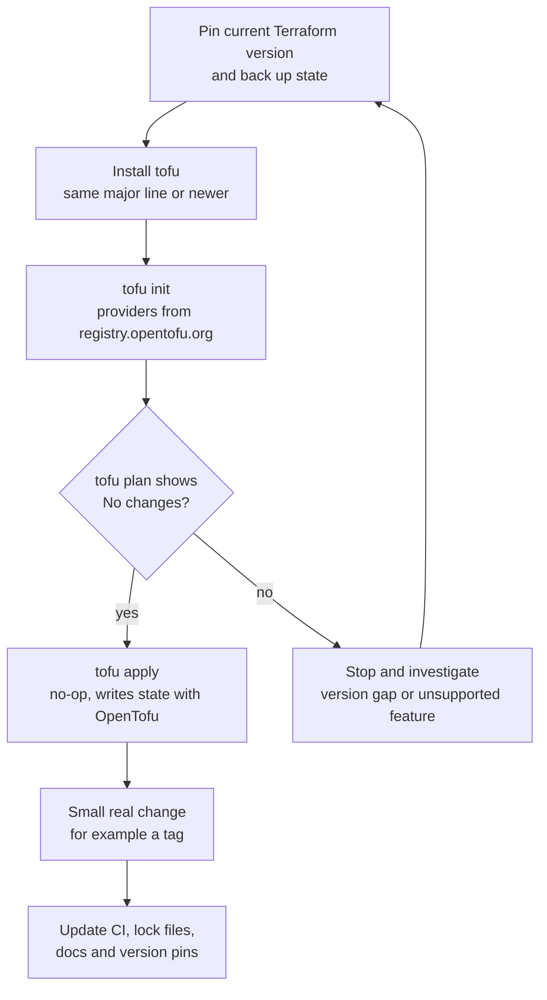

# Terraform: OpenTofu vs Terraform

> The 2023 license change, the OpenTofu fork and its governance, compatibility, the features that now differ (with the version that added each), migrating in both directions, CI/CD changes, and how an enterprise chooses.

## Key Concepts

### The license change (August 2023)

On **10 August 2023** HashiCorp announced that future releases of its core products, including Terraform, would move from the **Mozilla Public License 2.0 (MPL 2.0)** to the **Business Source License 1.1 (BUSL or BSL 1.1)**.

- **Terraform 1.5.7** (September 2023) is the last MPL 2.0 release.
- **Terraform 1.6.0** (October 2023) and every later release is BUSL 1.1.
- Provider SDKs, APIs and most libraries stayed MPL 2.0. Providers have their own licenses (most HashiCorp providers are still MPL 2.0).

What BUSL 1.1 means for Terraform, from its `LICENSE` file:

| Parameter | Value |
| --- | --- |
| Additional Use Grant | Production use is allowed, except offering Terraform to third parties on a hosted or embedded basis that competes with the licensor's paid versions |
| Change Date | Four years after each version is published |
| Change License | MPL 2.0 (each version becomes MPL 2.0 on its change date) |
| Licensor | Now IBM (IBM completed its HashiCorp acquisition on 27 February 2025) |

For most companies that only **use** Terraform to manage their own infrastructure, the license does not block anything. It matters for vendors building competing hosted IaC products, and for companies whose legal policy only allows OSI-approved open-source licenses. BUSL is source-available, not open source.

### The OpenTofu fork and governance

| Date | Event |
| --- | --- |
| Mid-August 2023 | OpenTF manifesto asks HashiCorp to revert the change |
| 25 August 2023 | OpenTF announces the fork |
| 20 September 2023 | Renamed **OpenTofu** and accepted into the **Linux Foundation** |
| 10 January 2024 | **OpenTofu 1.6.0** GA, the first stable release |
| April 2024 | HashiCorp sends a cease-and-desist about code in OpenTofu; OpenTofu publicly disputes it |
| 23 April 2025 | Accepted into the **CNCF** at Sandbox level |

OpenTofu was forked from the **last MPL-licensed Terraform code** (the 1.6 development line before the license change), so OpenTofu 1.6 is compatible with Terraform **1.5.x** and most of 1.6. It is licensed **MPL 2.0**, governed by a technical steering committee with members from several companies, and developed in the open (`opentofu/opentofu`, public RFCs). The CLI is `tofu`.

### What stays compatible

- **Language:** same HCL, same blocks, same `terraform {}` block name, same `.tf` files.
- **Providers:** same provider plugin protocol, so the same provider binaries work. `hashicorp/aws` in OpenTofu resolves to `registry.opentofu.org/hashicorp/aws`.
- **Registry:** OpenTofu runs its own registry (`registry.opentofu.org`) because the Terraform Registry terms allow downloads only for use with Terraform.
- **State:** same JSON state format (version 4), same backends (S3, azurerm, gcs, http, and more).
- **Workflow:** `init`, `plan`, `apply`, `import`, `state`, `test` all exist with the same meaning.

What does **not** move across: HCP Terraform / Terraform Enterprise features (Stacks, Sentinel, run tasks, the private registry) are HashiCorp products. OpenTofu users use other platforms (Spacelift, env0, Scalr, Harness, Atlantis, or plain CI).

### Features that differ, with versions

Since 2024 the two tools have diverged. The table is as of OpenTofu 1.13 and Terraform 1.16 (both released in September and August 2026).

| Feature | OpenTofu | Terraform |
| --- | --- | --- |
| Client-side **state and plan encryption** | 1.7 | Not in the CLI |
| `removed` block, `for_each` in `import` blocks | 1.7 | 1.7 |
| **Provider-defined functions** (`provider::aws::arn_parse(...)`) | 1.7 | 1.8 |
| **Early variable and locals evaluation** (backend config, module `source`, encryption config) | 1.8 | 1.15 adds `const` variables for module `source` and `version` |
| `.tofu` file extension (OpenTofu-only overrides) | 1.8 | Not applicable |
| Mock providers and overrides in tests | 1.8 | 1.7 |
| **`for_each` on provider blocks** | 1.9 | Not available |
| **`-exclude` flag** on plan and apply | 1.9 | Not available; only `-target` |
| OCI registries for providers and modules | 1.10 | Not available |
| Native S3 locking (`use_lockfile`, no DynamoDB) | 1.10 | 1.10 |
| `-target-file` / `-exclude-file` | 1.10 | Not available |
| Deprecating variables and outputs | 1.10 (experimental) | 1.15 |
| Ephemeral values and resources | 1.11 | 1.10 |
| Write-only attributes | 1.11 | 1.11 |
| `enabled` meta-argument (inside `lifecycle`) | 1.11 | Not available |
| `lifecycle { destroy = false }` | 1.12 | 1.16 |
| `convert` function, built-in linting (experimental) | 1.13 | `convert()` in 1.15 |
| `terraform query` and list resources, `action` blocks | Not available | 1.14 |
| Stacks, Sentinel, HCP Terraform integration | Not available | HashiCorp products |

Rule of thumb for interviews: once a configuration uses a feature that only one tool has, it is **locked to that tool**.

### Migration at a glance

Both directions follow the same safety pattern: back up state, switch the binary, run a plan, and only continue on "No changes".



## Interview Questions

<details><summary>Q1. [Basic] What exactly changed in Terraform's license in 2023, and does it affect a company that only uses Terraform internally?</summary>

**Answer:**

On 10 August 2023 HashiCorp moved Terraform from MPL 2.0 to the Business Source License 1.1. Terraform 1.5.7 is the last MPL release; 1.6.0 and later are BUSL.

BUSL is **source-available**, not open source. Terraform's BUSL has an "additional use grant": you may use it in production as long as you don't offer it to third parties as a hosted or embedded product that competes with the licensor's paid versions. Each version converts to MPL 2.0 four years after its release.

For a company that uses Terraform to manage its own AWS accounts, nothing in day-to-day use is blocked. It matters when:

- you sell a product or managed service that runs Terraform for customers,
- your legal policy only approves OSI open-source licenses, or
- you want to depend only on vendor-neutral, foundation-governed tools.

**What I would say in an interview:** "The license change is mostly a vendor and policy issue, not a technical one. The bigger long-term factor now is that the two tools have different features, so the choice affects your code."

Legal interpretation is for the legal team. I'd bring them the license text, not my own reading.

</details>

<details><summary>Q2. [Basic] Who maintains OpenTofu, and why does governance matter?</summary>

**Answer:**

OpenTofu is a Linux Foundation project (since 20 September 2023) and a CNCF Sandbox project (since 23 April 2025). It is MPL 2.0, and decisions are made by a technical steering committee with members from several companies, through public RFCs on GitHub.

Governance matters because a single-vendor tool can change its license, pricing, or direction, as Terraform did in 2023 and again when IBM bought HashiCorp in February 2025. A foundation-governed project with several contributing companies is harder to relicense. The flip side: OpenTofu depends on those sponsors staying funded and engaged, while Terraform has one large company behind it, paid support, and the HCP Terraform platform.

**How to check health in practice:** release cadence (OpenTofu has shipped a minor release every three to six months: 1.6 in January 2024 through 1.13 in September 2026), active maintainers, security response, and provider availability on the registry.

</details>

<details><summary>Q3. [Intermediate] How compatible are OpenTofu and Terraform: HCL, providers, registry and state?</summary>

**Answer:**

| Area | Compatible? | Detail |
| --- | --- | --- |
| HCL | Yes, for the common subset | Same syntax and block names, including `terraform {}`. Newer tool-specific features break compatibility |
| Providers | Yes | Same plugin protocol. Same binaries, published from the providers' own releases |
| Registry | Different hosts | `hashicorp/aws` means `registry.opentofu.org/hashicorp/aws` in `tofu` and `registry.terraform.io/hashicorp/aws` in `terraform` |
| Lock file | Different addresses | `.terraform.lock.hcl` entries are keyed by full provider address, so `tofu init` adds new entries |
| State | Yes, same format | State version 4. OpenTofu reads Terraform state of compatible versions. Encrypted OpenTofu state can't be read by Terraform |
| Backends | Mostly | S3, azurerm, gcs, http, pg work in both. The `cloud` block / HCP Terraform is a HashiCorp service |
| Modules | Yes | Modules from Git or registry work if they don't use tool-specific features |

The fork baseline matters: OpenTofu 1.6 started from Terraform's last MPL code, so the safest migration is from Terraform 1.5.x or 1.6.x. From newer Terraform versions, check which features you use (for example `terraform query`, `action` blocks, `const` variables) because OpenTofu may not have them.

**Pitfall:** `required_version` is checked against the running tool's own version. `required_version = "~> 1.5.0"` fails on `tofu` 1.10. Use a range like `>= 1.6.0` that is valid for the tool you run.

</details>

<details><summary>Q4. [Intermediate] What is OpenTofu state and plan encryption, and how do you enable it with AWS KMS?</summary>

**Answer:**

Since OpenTofu 1.7, OpenTofu can encrypt state and plan files **on the client** before they reach the backend. Even someone with read access to the S3 bucket sees ciphertext, including secrets that providers store in state. Terraform's CLI has no equivalent; it relies on backend encryption (S3 SSE-KMS) and bucket access control.

```hcl
terraform {
  encryption {
    key_provider "aws_kms" "state" {
      kms_key_id = "alias/tofu-state-prod"
      region     = "us-east-1"
      key_spec   = "AES_256"
    }

    method "aes_gcm" "state" {
      keys = key_provider.aws_kms.state
    }

    state {
      method   = method.aes_gcm.state
      enforced = true          # refuse to write unencrypted state
    }

    plan {
      method   = method.aes_gcm.state
      enforced = true
    }
  }
}
```

Key providers include `pbkdf2` (passphrase), `aws_kms`, `gcp_kms`, `azure_vault`, `openbao`, and since 1.10 `external` (run your own command to fetch the key). The only real encryption method is `aes_gcm`. The same config can be passed in the `TF_ENCRYPTION` environment variable so it isn't in the code.

**Migrating existing unencrypted state:** add an `unencrypted` method as a `fallback` for one apply, then remove the fallback:

```hcl
method "unencrypted" "migrate" {}

state {
  method = method.aes_gcm.state
  fallback {
    method = method.unencrypted.migrate
  }
}
```

**Verify:** `aws s3 cp s3://bucket/key - | head -c 200` shows encrypted JSON (`"encrypted_data"`), not resources.

**Pitfalls:** losing the key means losing the state, so protect the KMS key with deletion protection and tight key policy. `terraform_remote_state` readers also need the key (`remote_state_data_sources` block). And Terraform can no longer read this state.

</details>

<details><summary>Q5. [Intermediate] What problem does early variable evaluation solve, and how do the two tools compare?</summary>

**Answer:**

In classic Terraform, the `backend` block and module `source` must be literal strings. That is why teams use `-backend-config` files, wrapper scripts, or Terragrunt just to change the state bucket per environment.

OpenTofu 1.8 added **early evaluation**: variables and locals that can be known before any resource is read can be used in backend config, module `source` and `version`, and encryption config.

```hcl
variable "env" {
  type = string
}

terraform {
  backend "s3" {
    bucket       = "acme-tfstate-${var.env}"
    key          = "network/terraform.tfstate"
    region       = "us-east-1"
    use_lockfile = true
  }
}

module "vpc" {
  source = "git::https://github.com/acme/tf-modules.git//vpc?ref=${var.module_ref}"
}
```

```bash
tofu init -var="env=prod" -var="module_ref=v3.2.0"
```

Terraform 1.15 (April 2026) added something similar for modules: variables marked `const` can be used in module `source` and `version`. It is a newer, narrower feature with different syntax, so code using either one is not portable.

**Pitfall:** the variable must be supplied at `init` time as well as at `plan` time, and it must not depend on resources or data sources.

</details>

<details><summary>Q6. [Intermediate] Explain provider <code>for_each</code> and the <code>-exclude</code> flag. Which tool has them?</summary>

**Answer:**

Both arrived in **OpenTofu 1.9** (January 2025). Terraform has neither as of 1.16.

**Provider `for_each`** removes copy-pasted provider blocks for multi-region or multi-account setups:

```hcl
variable "regions" {
  type    = set(string)
  default = ["us-east-1", "eu-west-1"]
}

provider "aws" {
  alias    = "by_region"
  for_each = var.regions
  region   = each.key
}

resource "aws_s3_bucket" "logs" {
  for_each = var.regions
  provider = aws.by_region[each.key]
  bucket   = "acme-logs-${each.key}"
}
```

The provider must have an alias, and the `for_each` value must be known early (variables or locals, not resource attributes).

**`-exclude`** is the opposite of `-target`: plan or apply everything **except** some addresses.

```bash
tofu plan -exclude=module.legacy_dns
tofu apply -exclude=aws_db_instance.main
```

OpenTofu 1.10 added `-target-file` and `-exclude-file`, so the list can be reviewed in Git.

**Pitfall:** like `-target`, `-exclude` is for exceptional situations (a broken resource blocking an urgent change). Regular use means your state is too big and should be split.

</details>

<details><summary>Q7. [Intermediate] How do you migrate a project from Terraform to OpenTofu step by step?</summary>

**Answer:**

1. **Check the starting point:** run `terraform plan` and make sure it shows **No changes**. Migrating with pending changes mixes two problems.
2. **Check versions and features:** note the Terraform version and look for features OpenTofu doesn't have (for example `terraform query`, `action` blocks, `const` variables). If state lives in HCP Terraform, plan a move to a standard backend such as S3 first. Remove or replace these before switching.
3. **Back up state:**

   ```bash
   terraform state pull > backup-$(date +%F).tfstate
   ```

   Also confirm S3 versioning is on for the state bucket.
4. **Install OpenTofu** at a pinned version and update `required_version` if it is too narrow.
5. **Initialize:**

   ```bash
   tofu init -upgrade=false
   ```

   Providers now come from `registry.opentofu.org`, and the lock file gets OpenTofu addresses.
6. **Plan:** `tofu plan` must show **No changes**. If it doesn't, stop and investigate.
7. **Apply once:** `tofu apply` with no changes, so the state is written by OpenTofu.
8. **Make one small real change** (a tag) through the normal pipeline.
9. **Update everything around it:** CI images, lock files for all platforms, pre-commit hooks, docs, runbooks.
10. **Repeat per state**, starting with low-risk stacks.

**Verify:** `tofu state list` matches the old `terraform state list`, and a no-op plan runs clean in CI.

</details>

<details><summary>Q8. [Advanced] How do you move from OpenTofu back to Terraform, and what can block it? <em>(scenario)</em></summary>

**Answer:**

The happy path mirrors the forward migration:

1. Make sure `tofu plan` shows no changes and back up state.
2. Remove OpenTofu-only features from the code.
3. `terraform init`, then `terraform plan`. Expect **No changes**.
4. Restore the backup if anything looks wrong.

What blocks it:

| Blocker | Fix |
| --- | --- |
| **State encryption** | Decrypt first: set the `unencrypted` method as primary with the old `aes_gcm` method as fallback and `enforced = false`, run `tofu apply`, confirm the stored state is plain JSON |
| Provider `for_each` | Expand to one aliased provider block per region or account |
| Early-evaluated backend or module source | Move to literal values plus `-backend-config` |
| `-exclude` in scripts | Rewrite as `-target`, or split the state |
| `.tofu` files | Terraform ignores them; merge the logic into `.tf` files |
| `enabled` meta-argument | Replace with `count = var.x ? 1 : 0` and `moved` blocks for the address change |
| Version gap | Terraform must be new enough for the state and features used |

```hcl
# Decrypt-to-plaintext step before going back
terraform {
  encryption {
    method "aes_gcm" "old" {
      keys = key_provider.aws_kms.state
    }
    method "unencrypted" "plain" {}
    state {
      method   = method.unencrypted.plain
      enforced = false
      fallback {
        method = method.aes_gcm.old
      }
    }
  }
}
```

**Interview point:** "reversible" is only true while you stay inside the shared feature set. Every tool-specific feature you adopt is a one-way door unless you plan its removal.

</details>

<details><summary>Q9. [Intermediate] How do you write a shared module that works with both Terraform and OpenTofu?</summary>

**Answer:**

1. Stick to features both tools have, and set a broad `required_version` (for example `>= 1.6.0`).
2. Test the module with both binaries in CI (a matrix job).
3. For OpenTofu-only improvements, use **`.tofu` files** (OpenTofu 1.8+). If `main.tofu` and `main.tf` both exist, OpenTofu uses `main.tofu` and ignores `main.tf`. Terraform ignores `.tofu` files.

```text
modules/s3-bucket/
  main.tf          # portable version, used by Terraform
  main.tofu        # same resources, plus OpenTofu-only features
  variables.tf
  outputs.tf
```

4. Publish the module to both registries or use Git sources with tags.
5. Document which tools and versions are tested.

**Pitfall:** `.tofu` files duplicate code. Keep them small and only where the gain is real, or two copies drift apart.

</details>

<details><summary>Q10. [Advanced] What changes in CI/CD when you switch from Terraform to OpenTofu?</summary>

**Answer:**

| Area | Change |
| --- | --- |
| Binary install | GitHub Actions: `opentofu/setup-opentofu` instead of `hashicorp/setup-terraform`. Azure DevOps: install script or a pinned image with `tofu` |
| Commands | `terraform` becomes `tofu` in scripts, Makefiles and wrappers. An alias works short-term but hides which tool runs |
| Lock file | Commit the new `.terraform.lock.hcl` with `registry.opentofu.org` entries and hashes for every runner platform |
| Provider cache and mirrors | Internal mirrors or Artifactory remotes must proxy `registry.opentofu.org` (or OCI registries from 1.10) |
| Plan artifacts | If plan encryption is on, the apply job needs the same key. Plan files are not portable between tools |
| Wrappers and TACOS | Terragrunt, Atlantis, Spacelift, env0, Scalr support OpenTofu, but each needs the tool configured. HCP Terraform runs Terraform only |
| Scanners and linters | tflint, Checkov, Trivy and policy tools read HCL and plan JSON; check they understand new syntax such as encryption blocks |
| Version policy | Pin the exact `tofu` version, upgrade on a schedule, follow the security support window (each minor is supported about as long as its Go release line) |

```yaml
# GitHub Actions
- uses: opentofu/setup-opentofu@v1
  with:
    tofu_version: 1.13.1
- run: tofu init -input=false
- run: tofu plan -input=false -out=tfplan
```

```yaml
# Azure DevOps
- script: |
    curl --proto '=https' --tlsv1.2 -fsSL https://get.opentofu.org/install-opentofu.sh -o install-opentofu.sh
    chmod +x install-opentofu.sh
    ./install-opentofu.sh --install-method standalone --opentofu-version 1.13.1
  displayName: Install OpenTofu
```

The standalone installer verifies the download signature, so the agent needs `cosign` or `gpg` installed.

**Rollout:** switch non-prod pipelines first, run both tools in parallel for a while (`tofu plan` must match `terraform plan`), then switch prod.

See also [Terraform CI/CD, testing and security](09-cicd-testing-and-security.md).

</details>

<details><summary>Q11. [Advanced] After switching to OpenTofu, CI fails with checksum or "provider not found" errors. How do you fix it? <em>(scenario)</em></summary>

**Answer:**

Likely causes:

1. **Lock file has only Terraform addresses or one platform's hashes.** The developer ran `tofu init` on a Mac, but CI runs on Linux.

   ```bash
   tofu providers lock \
     -platform=linux_amd64 -platform=linux_arm64 -platform=darwin_arm64
   git add .terraform.lock.hcl
   ```

   OpenTofu 1.12 and later record checksums for all platforms at `init` automatically, which removes most of this.
2. **Network:** the runner can reach `registry.terraform.io` but not `registry.opentofu.org` or the GitHub release downloads. Update the egress allowlist or proxy.
3. **Provider mirror:** a `provider_installation` block in the CLI config points to an internal mirror that only proxies the Terraform registry.
4. **Provider not on the OpenTofu registry:** rare for major providers, possible for small or private ones. Publish it to a private registry or an OCI registry, or use a filesystem mirror.
5. **Explicit hostname in `source`:** `source = "registry.terraform.io/acme/foo"` forces the Terraform registry. Use the short form `acme/foo`.

**Verify:** `tofu init` in a clean container that matches CI, then `tofu providers` to see where each provider came from.

</details>

<details><summary>Q12. [Advanced] You have 80 Terraform state files with <code>terraform_remote_state</code> dependencies. How do you migrate them to OpenTofu safely? <em>(scenario)</em></summary>

**Answer:**

1. **Inventory:** list every root module, its Terraform version, backend, providers, and who reads its outputs (`terraform_remote_state`, data sources, pipelines).
2. **Upgrade lagging stacks first** to one Terraform version near the fork baseline, so every stack starts from the same place.
3. **Migrate without encryption first.** Plain OpenTofu state is still readable by Terraform, so consumers on Terraform keep working. This is the key to doing it in waves.
4. **Order:** leaf stacks (nothing reads them) first, then shared foundations (network, IAM) last, or migrate producer and consumers together.
5. **Per stack:** no-op plan, backup, `tofu init`, `tofu plan` with no changes, `tofu apply`, update pipeline.
6. **Turn on encryption only after** every consumer of that state runs OpenTofu, and configure `remote_state_data_sources` with the same key in each consumer.
7. **Track progress** in a simple table: stack, owner, status, date, rollback point.

**Pitfall:** turning on encryption for a shared network stack while 30 consumers still run Terraform. Every one of them fails to read the outputs.

</details>

<details><summary>Q13. [Advanced] How would you choose between Terraform and OpenTofu for an enterprise?</summary>

**Answer:**

I'd decide on concrete criteria, not on the license headlines.

| Question | Points to Terraform | Points to OpenTofu |
| --- | --- | --- |
| Platform | You use or want HCP Terraform / Terraform Enterprise, Sentinel, Stacks | You use Spacelift, env0, Scalr, Atlantis or plain CI |
| Support | You need a vendor support contract from the tool's owner | Community plus commercial support from platform vendors is enough |
| License policy | BUSL is approved by legal | Legal requires OSI open source, or you build a product on top of the tool |
| Features | You want `terraform query`, actions, Stacks | You want state encryption, provider `for_each`, `-exclude`, early evaluation, OCI registries |
| Ecosystem | Partner integrations certified for Terraform | Vendor-neutral, foundation-governed roadmap |
| Cost of change | Large estate, no pain today | Already planning a platform change, or a new estate |

My recommendation pattern:

- **New platform, no HCP Terraform:** OpenTofu is a strong default. State encryption alone helps audits.
- **Heavy HCP Terraform or TFE user:** stay on Terraform unless there is a business reason to change the whole platform.
- **Either way:** pin versions, keep modules portable where you can, and record the decision in an ADR with a review date, because both tools keep changing.

TODO (Siva): add which tool your current team uses (OpenTofu or Terraform), why it was chosen, and anything you would do differently.

</details>

<details><summary>Q14. [Advanced] The KMS key used for OpenTofu state encryption must be rotated, or was scheduled for deletion by mistake. What do you do? <em>(scenario)</em></summary>

**Answer:**

**Planned rotation:** OpenTofu supports a `fallback` method for this. Configure the new key as primary and the old one as fallback, run `tofu apply` (a no-op apply rewrites the state with the new key), confirm, then remove the fallback.

```hcl
key_provider "aws_kms" "new" {
  kms_key_id = "alias/tofu-state-prod-2026"
  region     = "us-east-1"
  key_spec   = "AES_256"
}
key_provider "aws_kms" "old" {
  kms_key_id = "alias/tofu-state-prod"
  region     = "us-east-1"
  key_spec   = "AES_256"
}
method "aes_gcm" "new" { keys = key_provider.aws_kms.new }
method "aes_gcm" "old" { keys = key_provider.aws_kms.old }

state {
  method = method.aes_gcm.new
  fallback {
    method = method.aes_gcm.old
  }
}
```

Do the same for every stack that uses the key, and for consumers in `remote_state_data_sources`.

**Key scheduled for deletion by mistake:** AWS KMS keys have a 7 to 30 day waiting period.

1. Cancel deletion immediately: `aws kms cancel-key-deletion --key-id <id>`, then re-enable the key.
2. Check CloudTrail for who scheduled it.
3. Rotate to a new key as above, if trust in the old key is in doubt.
4. Add guardrails: an SCP or key policy that denies `kms:ScheduleKeyDeletion` except for a break-glass role, and an alarm on that API call.

If the key is really gone, encrypted state can't be decrypted. Recovery means restoring an older unencrypted backup or re-importing every resource, which is why the key needs the same protection as the state itself.

</details>
